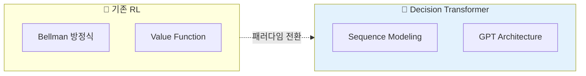
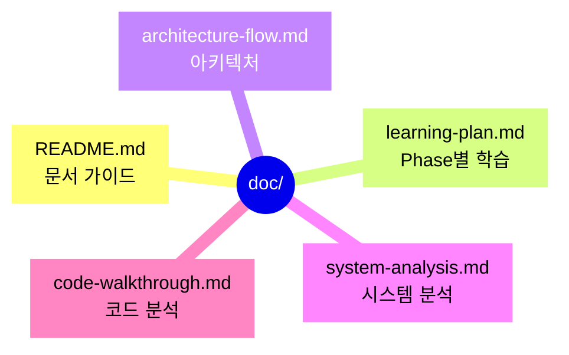
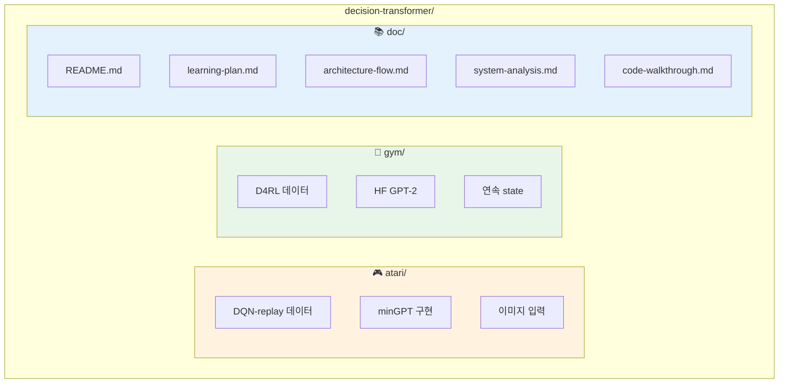
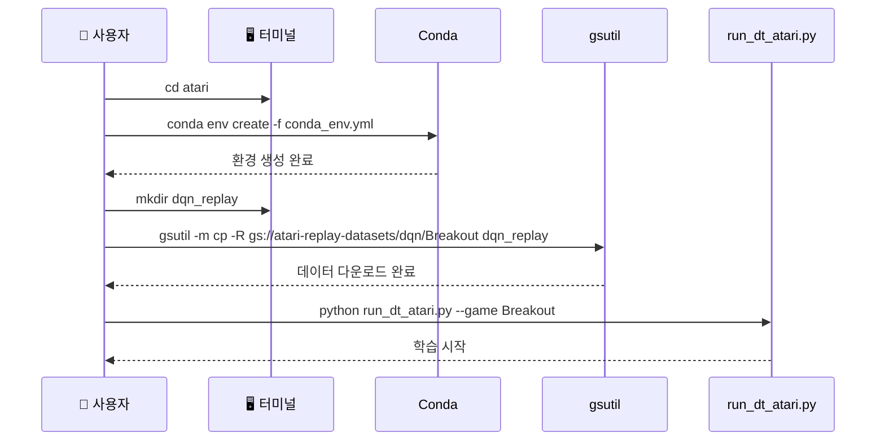
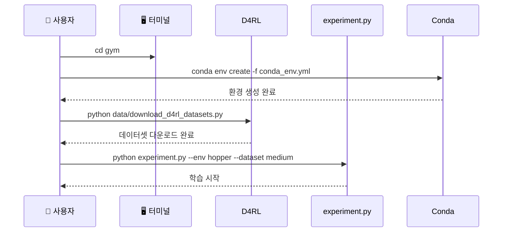
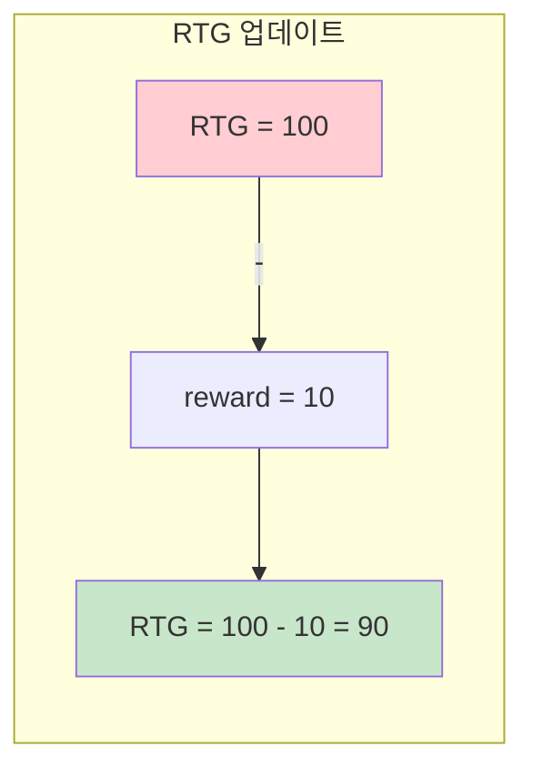
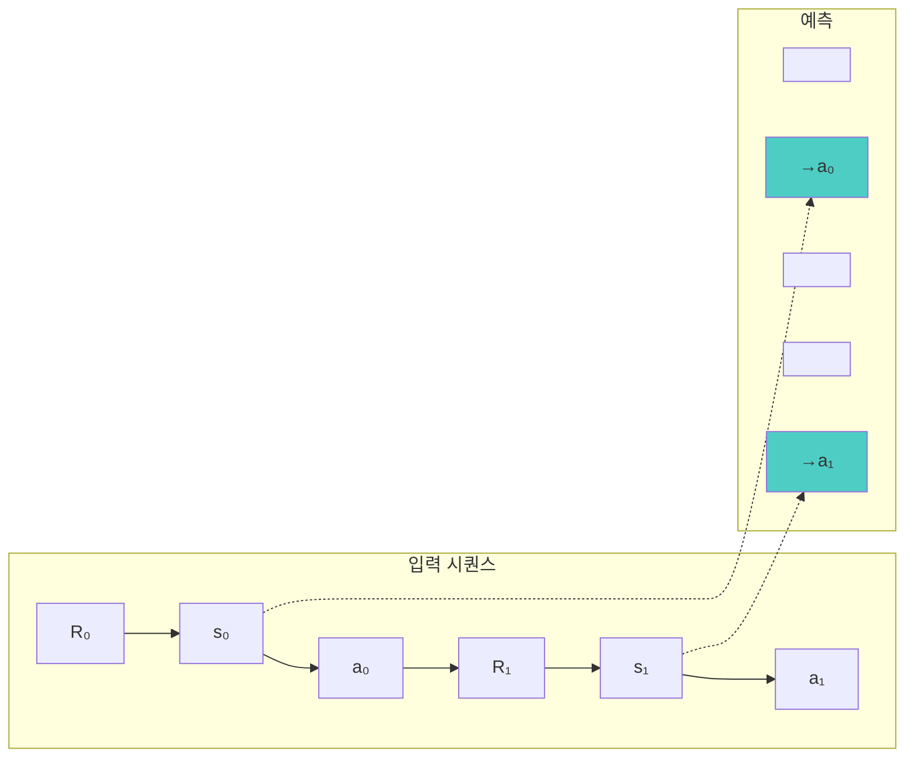
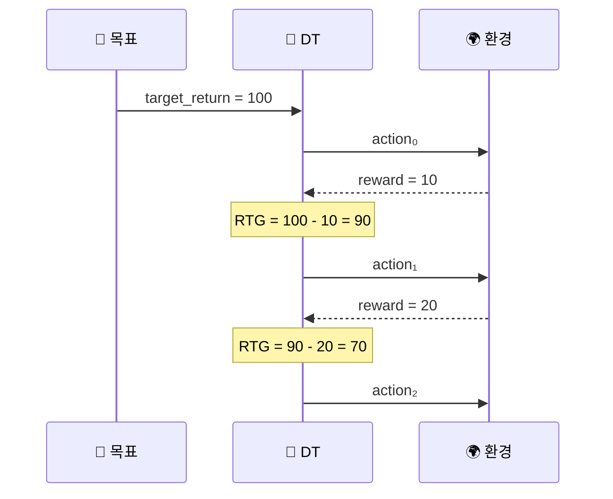
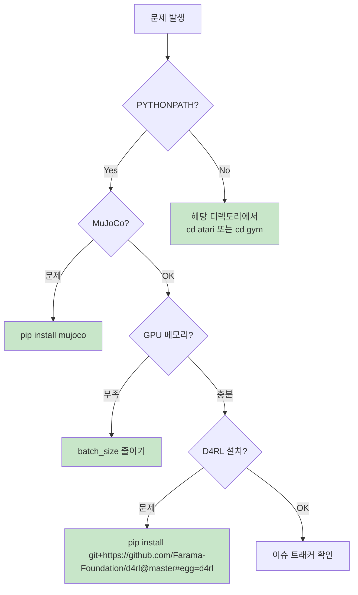

# CLAUDE.md

이 파일은 Claude Code (claude.ai/code)가 이 저장소의 코드를 작업할 때 참조하는 가이드입니다.

## 📋 문서 작성 가이드라인

이 프로젝트의 문서는 **시각화**를 최우선으로 합니다. 설명을 추가할 때는 다음 순서를 따르세요:

1. **먼저 다이어그램으로**: `sequenceDiagram`, `flowchart`, `graph` 등으로 시각화
2. **핵심만 요약**: 텍스트는 다이어그램의 보조 역할로만 사용
3. **상세 내용은 `doc/`로**: 긴 설명은 `doc/`의 적절한 문서에 위임

### 권장 다이어그램 유형

| 용도 | 추천 다이어그램 | 예시 |
|------|----------------|------|
| **시간 순서 흐름** | `sequenceDiagram` | 추론 과정, 학습 루프, 함수 호출 순서 |
| **데이터 처리 파이프라인** | `flowchart TD` | 전처리, 모델 forward, 평가 과정 |
| **아키텍처 구조** | `flowchart TB` + `subgraph` | 모델 구조, 모듈 관계 |
| **상태 전환** | `stateDiagram-v2` | 에피소드 진행, RTG 업데이트 |
| **개념 비교** | `flowchart LR` (분기형) | DT vs BC, Atari vs Gym |

---

## Quick Overview

Decision Transformer는 강화학습을 **시퀀스 모델링 문제**로 재구성한 연구입니다.

**📖 상세 설명**: [`doc/system-analysis.md`](./doc/system-analysis.md#1-개요)

---

## 📚 상세 문서 맵

| 문서 | 용도 | 링크 |
|------|------|------|
| **문서 가이드** | `doc/` 구조 및 학습 경로 | [`doc/README.md`](./doc/README.md) |
| **학습 계획** | Phase별 학습 로드맵 | [`doc/learning-plan.md`](./doc/learning-plan.md) |
| **아키텍처** | 전체 시스템 다이어그램 | [`doc/architecture-flow.md`](./doc/architecture-flow.md) |
| **시스템 분석** | Atari + Gym 비교 | [`doc/system-analysis.md`](./doc/system-analysis.md) |
| **코드 분석** | 구현 상세 설명 | [`doc/code-walkthrough.md`](./doc/code-walkthrough.md) |

---

## Project Structure

---

## Quick Start

### Atari 환경

### Gym 환경

---

## Core Concepts

### Return-to-Go (RTG)

**📖 상세**: [`doc/learning-plan.md`](./doc/learning-plan.md#22-return-to-go-개념-깊이-이해)

### Sequence Structure

**📖 상세**: [`doc/architecture-flow.md`](./doc/architecture-flow.md#6-모델별-시퀀스-구성-비교)

### Inference Flow

**📖 상세**: [`doc/architecture-flow.md`](./doc/architecture-flow.md#5-평가-추론-과정)

---

## Environment Comparison

| 항목 | Atari | Gym |
|------|-------|-----|
| **디렉토리** | `atari/` | `gym/` |
| **실행 위치** | `cd atari` | `cd gym` |
| **Context Length** | 30 | 20 |
| **State** | 이미지 (4×84×84) | 연속 벡터 |
| **Action** | 이산적 (분류) | 연속적 (회귀) |
| **모델** | minGPT (6L, 8H) | HF GPT-2 (3L, 1H) |
| **데이터셋** | DQN replay buffers | D4RL pickle |

**📖 상세**: [`doc/system-analysis.md`](./doc/system-analysis.md#84-atari-vs-gym-차이점)

---

## Common Issues

---

## References

- **논문**: [Decision Transformer: Reinforcement Learning via Sequence Modeling](https://arxiv.org/abs/2106.01345)
- **원본 코드**: [https://github.com/kzl/decision-transformer](https://github.com/kzl/decision-transformer)
- **상세 문서**: [`doc/`](./doc/) 디렉토리 참조
