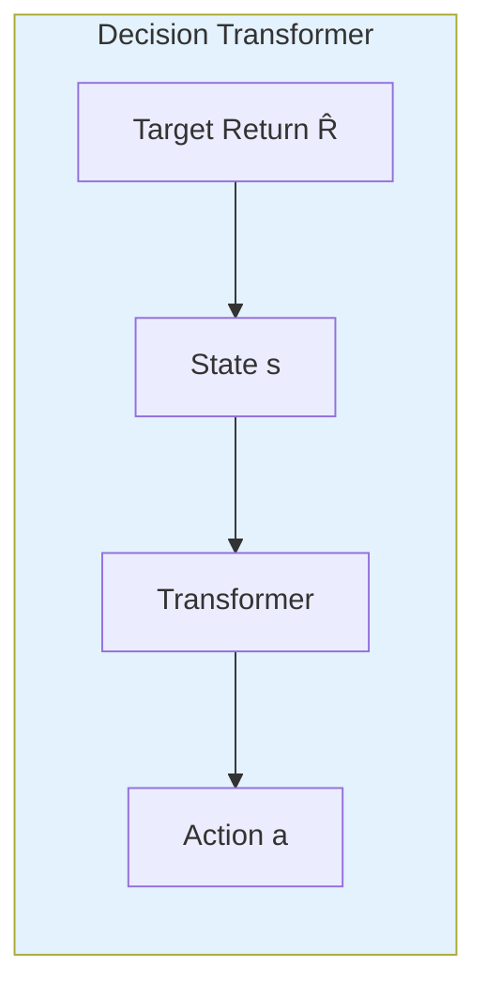
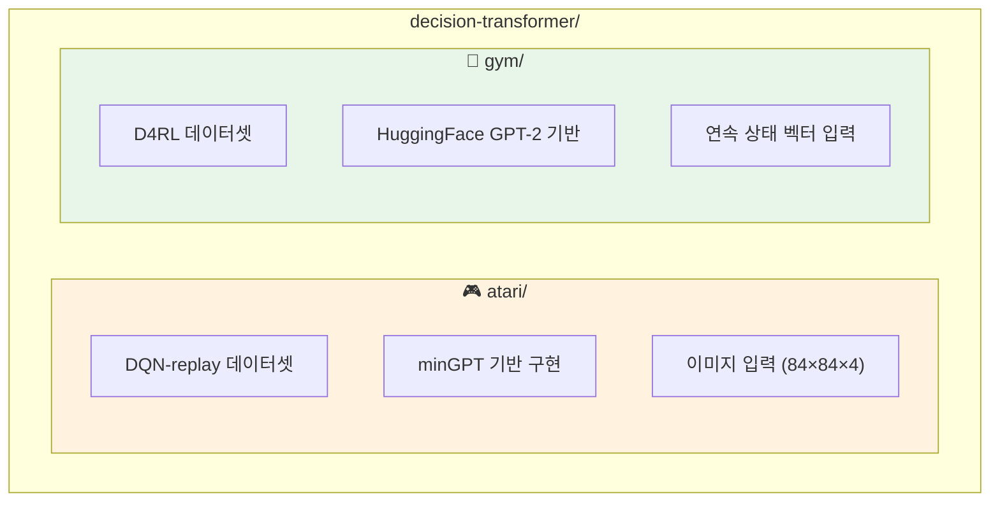

# CLAUDE.md

이 파일은 Claude Code (claude.ai/code)가 이 저장소의 코드를 작업할 때 참조하는 가이드입니다.

## Quick Overview

Decision Transformer는 강화학습을 **시퀀스 모델링 문제**로 재구성한 연구입니다. GPT 아키텍처를 사용하여 (return-to-go, state, action) 시퀀스를 모델링하고, 원하는 return을 조건으로 하여 행동을 예측합니다.



## 📚 상세 문서

프로젝트의 상세한 기술 문서는 [`doc/`](./doc/) 디렉토리를 참조하세요:

| 문서 | 설명 |
|------|------|
| [`doc/README.md`](./doc/README.md) | 문서 가이드 및 학습 경로 |
| [`doc/learning-plan.md`](./doc/learning-plan.md) | Phase별 학습 계획 (초보자 추천) |
| [`doc/architecture-flow.md`](./doc/architecture-flow.md) | 아키텍처 다이어그램 |
| [`doc/system-analysis.md`](./doc/system-analysis.md) | 전체 시스템 분석 |
| [`doc/code-walkthrough.md`](./doc/code-walkthrough.md) | 코드 상세 분석 |

## Project Structure



## Quick Start Commands

### Atari 환경

```bash
cd atari
conda env create -f conda_env.yml
conda activate decision-transformer-atari

# 데이터셋 다운로드 (gsutil 필요)
mkdir dqn_replay
gsutil -m cp -R gs://atari-replay-datasets/dqn/Breakout dqn_replay

# 학습 실행
python run_dt_atari.py --game Breakout --model_type reward_conditioned
```

### Gym 환경

```bash
cd gym
conda env create -f conda_env.yml
conda activate decision-transformer-gym

# 데이터셋 다운로드 (D4RL 설치 필요)
python data/download_d4rl_datasets.py

# 학습 실행
python experiment.py --env hopper --dataset medium --model_type dt
```

## Important Implementation Notes

| 항목 | Atari | Gym |
|------|-------|-----|
| **실행 위치** | `cd atari` | `cd gym` |
| **Context Length** | 30 | 20 |
| **State 형태** | 이미지 (4×84×84) | 연속 벡터 |
| **모델** | minGPT (6 layers, 8 heads) | HuggingFace GPT-2 |
| **데이터셋** | DQN replay buffers | D4RL pickle |

## Core Concepts

### Return-to-Go (RTG)
- 각 타임스텝에서 **에피소드 끝까지의 누적 보상**
- 학습 시: 데이터에서 계산된 실제 값
- 추론 시: 목표 return을 설정하고 동적으로 업데이트 (`rtg -= reward`)

### Sequence Structure
```
입력: [R₀, s₀, a₀, R₁, s₁, a₁, R₂, s₂, a₂, ...]
예측: [  , →a₀,   ,   , →a₁,   ,   , →a₂,   ]
       └─ s₀에서 ─┘   └─ s₁에서 ─┘   └─ s₂에서 ─┘
```

### Model Types
- **reward_conditioned** (Decision Transformer): RTG로 목표 지정
- **naive** (Behavior Cloning): RTG 없이 단순 모방 학습

## File Organization

```
decision-transformer/
├── atari/                          # Atari 환경
│   ├── run_dt_atari.py            # 메인 스크립트
│   ├── create_dataset.py          # 데이터셋 생성
│   └── mingpt/                    # GPT 모델
│       ├── model_atari.py         # CNN encoder + Transformer
│       └── trainer_atari.py       # 학습 루프
│
├── gym/                           # Gym 환경
│   ├── experiment.py              # 메인 스크립트
│   └── decision_transformer/
│       ├── models/                # DT 모델, GPT-2, BC
│       ├── training/              # SequenceTrainer, ActTrainer
│       └── evaluation/            # RTG 조건부 평가
│
├── doc/                           # 📚 상세 문서
│   ├── README.md                  # 문서 가이드
│   ├── learning-plan.md           # 학습 계획
│   ├── architecture-flow.md       # 아키텍처 다이어그램
│   ├── system-analysis.md         # 시스템 분석
│   └── code-walkthrough.md        # 코드 분석
│
└── CLAUDE.md                      # 본 파일
```

## Common Issues

- **PYTHONPATH**: 각 디렉토리(`atari/`, `gym/`)에서 실행하면 자동으로 설정됨
- **MuJoCo 라이선스**: Gym 환경은 MuJoCo 2.1+ 필요 (무료)
- **GPU 메모리**: Atari 학습 시 배치 크기 조절 필요할 수 있음
- **off-by-one 버그**: rtg 계산 버그는 수정됨 (최근 커밋 참조)

## References

- **논문**: [Decision Transformer: Reinforcement Learning via Sequence Modeling](https://arxiv.org/abs/2106.01345)
- **코드**: 원본 구현은 [https://github.com/kzl/decision-transformer](https://github.com/kzl/decision-transformer)
