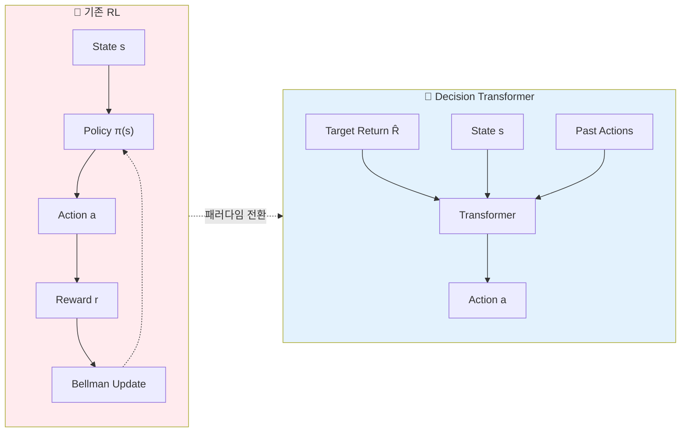
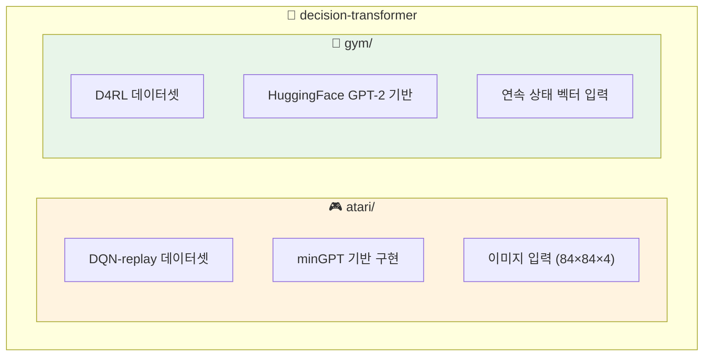
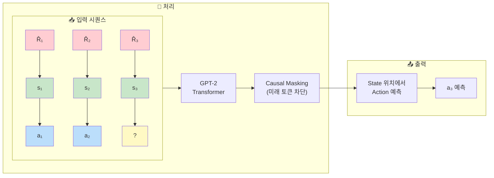
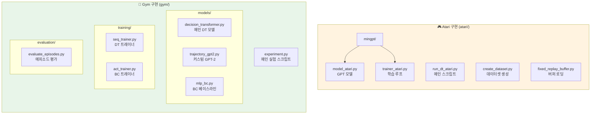
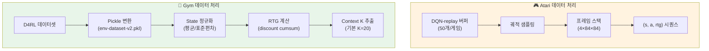
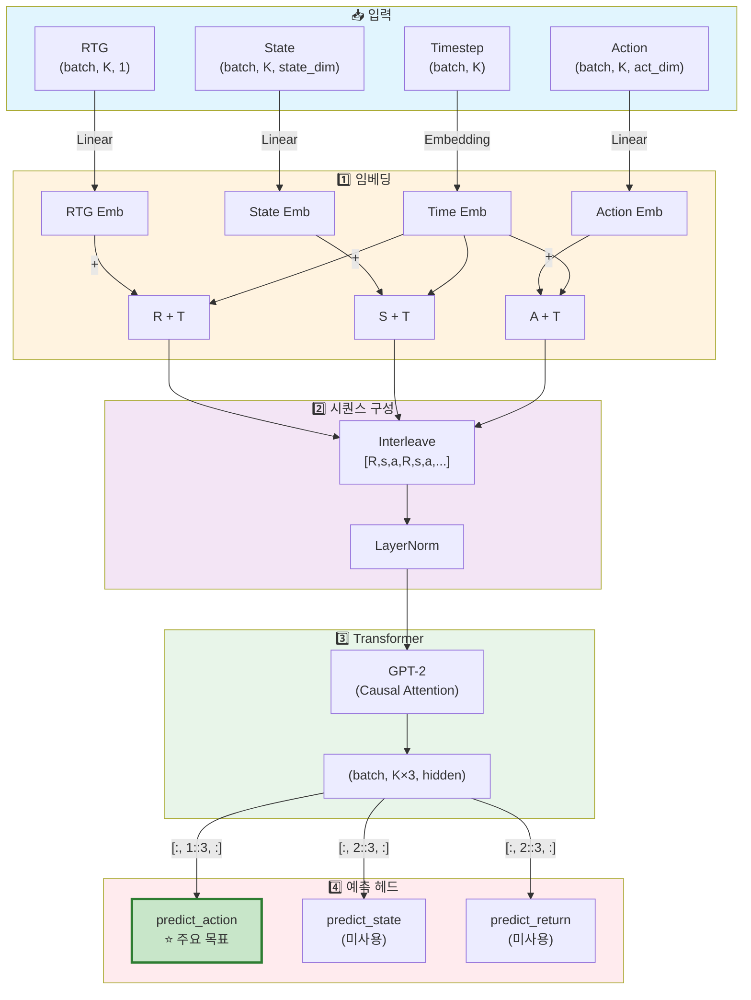
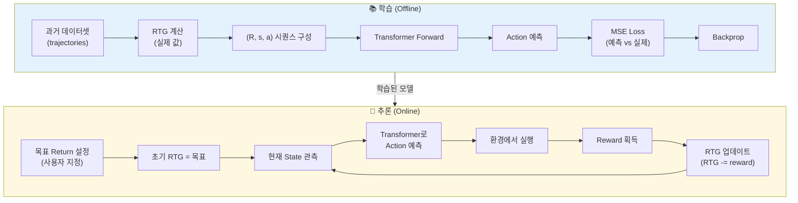
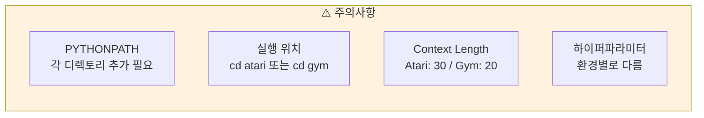

# CLAUDE.md

This file provides guidance to Claude Code (claude.ai/code) when working with code in this repository.

## Overview

Decision Transformer는 강화학습을 시퀀스 모델링 문제로 재구성한 연구 프로젝트입니다. GPT 아키텍처를 사용하여 (return-to-go, state, action) 시퀀스를 모델링하고, 원하는 return을 조건으로 하여 행동을 예측합니다.



이 저장소는 두 개의 독립적인 실험 환경을 포함합니다:



## Development Commands

### Atari 환경

**환경 설정:**
```bash
cd atari
conda env create -f conda_env.yml
conda activate decision-transformer-atari
```

**데이터셋 다운로드:**
```bash
mkdir dqn_replay
gsutil -m cp -R gs://atari-replay-datasets/dqn/[GAME_NAME] dqn_replay
# 예: gsutil -m cp -R gs://atari-replay-datasets/dqn/Breakout dqn_replay
```

**단일 실험 실행:**
```bash
cd atari
python run_dt_atari.py --seed 123 --context_length 30 --epochs 5 \
  --model_type 'reward_conditioned' --num_steps 500000 --num_buffers 50 \
  --game 'Breakout' --batch_size 128 --data_dir_prefix ./dqn_replay
```

**재현 스크립트 실행:**
```bash
cd atari
bash run.sh  # 여러 게임과 seed에 대한 전체 실험 실행
```

**모델 타입:**
- `reward_conditioned`: Decision Transformer (DT)
- `naive`: Behavior Cloning (BC) 베이스라인

### OpenAI Gym 환경

**환경 설정:**
```bash
cd gym
conda env create -f conda_env.yml
conda activate decision-transformer-gym
```

**데이터셋 다운로드:**
```bash
cd gym
# D4RL 설치 필요: https://github.com/rail-berkeley/d4rl
python data/download_d4rl_datasets.py
```

**실험 실행:**
```bash
cd gym
python experiment.py --env hopper --dataset medium --model_type dt

# Weights & Biases 로깅 활성화
python experiment.py --env hopper --dataset medium --model_type dt -w True
```

**지원되는 환경:**
- `hopper`: Hopper-v3
- `halfcheetah`: HalfCheetah-v3
- `walker2d`: Walker2d-v3
- `reacher2d`: 커스텀 Reacher2D 환경

**지원되는 데이터셋:**
- `medium`, `medium-replay`, `medium-expert`, `expert` (D4RL 데이터셋 종류)

**모델 타입:**
- `dt`: Decision Transformer
- `bc`: Behavior Cloning

## Architecture Overview

### Core Sequence Modeling Approach

Decision Transformer는 기존 RL의 벨만 방정식 대신 autoregressive sequence modeling을 사용합니다:



**핵심 개념:**
- 입력: `(R_1, s_1, a_1, R_2, s_2, a_2, ...)` 형태의 시퀀스
- R은 returns-to-go (미래 누적 보상)
- GPT-2 기반 transformer가 state에서 action을 예측
- 조건부 생성: 원하는 return을 지정하여 행동 정책을 유도

### Key Components



### Data Processing



### Model Details

**Decision Transformer 아키텍처:**



**시퀀스 구성** ([decision_transformer.py:73-78](gym/decision_transformer/models/decision_transformer.py#L73-L78)):
```python
# (R, s, a) 트리플을 스택하여 시퀀스 생성
# 최종 형태: [batch, seq_len*3, hidden_dim]
# R_1, s_1, a_1, R_2, s_2, a_2, ...
```

**예측 헤드** ([decision_transformer.py:97-99](gym/decision_transformer/models/decision_transformer.py#L97-L99)):
- `predict_action`: state 토큰에서 다음 action 예측 (주요 목표)
- `predict_state`: action 토큰에서 다음 state 예측 (논문에서 미사용)
- `predict_return`: action 토큰에서 다음 return 예측 (논문에서 미사용)

**추론 시** ([decision_transformer.py:103-140](gym/decision_transformer/models/decision_transformer.py#L103-L140)):
- `get_action()`: 현재까지의 궤적과 원하는 rtg를 받아 다음 action 반환
- Max length로 컨텍스트 윈도우 제한, 패딩 처리

### 학습 vs 추론 흐름



## Important Implementation Notes



- **PYTHONPATH 설정**: 각 디렉토리(`atari/`, `gym/`)를 PYTHONPATH에 추가해야 할 수 있음
- **스크립트 실행 위치**: 항상 해당 하위 디렉토리에서 실행 (`cd atari` 또는 `cd gym`)
- **모델 체크포인트**: Atari는 자동으로 체크포인트 저장, Gym은 wandb 옵션 사용 시 로깅
- **Context length**: Atari는 `context_length` (기본 30), Gym은 `K` (기본 20) 파라미터로 제어
- **하이퍼파라미터**: 각 게임/환경마다 최적 설정이 다름 - `run.sh` 또는 `experiment.py` 참조

## Known Issues

- **off-by-one 버그 수정됨**: rtg 계산 관련 버그 패치 적용됨 (최근 커밋 참조)
- **MuJoCo 라이선스**: Gym 환경은 MuJoCo 설치 및 라이선스 필요
- **GPU 메모리**: Atari 학습 시 배치 크기 조절 필요할 수 있음
