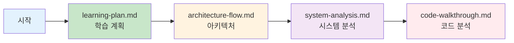

# Decision Transformer 문서

이 디렉토리는 Decision Transformer 프로젝트의 상세 기술 문서를 포함합니다.

## 📚 문서 가이드

### 빠른 시작
- **처음 오신 분**: [`learning-plan.md`](./learning-plan.md)에서 단계별 학습 계획을 확인하세요
- **아키텍처 이해**: [`architecture-flow.md`](./architecture-flow.md)로 전체 시스템 흐름을 파악하세요
- **코드 분석**: [`code-walkthrough.md`](./code-walkthrough.md)로 구현 상세를 이해하세요
- **시스템 분석**: [`system-analysis.md`](./system-analysis.md)로 전체 시스템을 종합적으로 분석하세요

### 문서별 설명

| 문서 | 설명 | 대상 독자 |
|------|------|----------|
| [`learning-plan.md`](./learning-plan.md) | Phase별 학습 계획과 실습 가이드 | Decision Transformer를 처음 접하는 분 |
| [`architecture-flow.md`](./architecture-flow.md) | Atari 환경의 아키텍처와 데이터 흐름 | 전체 시스템 구조를 빠르게 파악하고 싶은 분 |
| [`system-analysis.md`](./system-analysis.md) | Atari + Gym 전체 시스템 분석 | 두 환경의 차이와 공통점을 이해하고 싶은 분 |
| [`code-walkthrough.md`](./code-walkthrough.md) | Atari 코드 구현 상세 분석 | 코드 레벨에서 구현을 이해하고 싶은 분 |

## 🎯 학습 경로 추천



## 📖 주요 개념 링크

### Return-to-Go (RTG)
- [architecture-flow.md - RTG 계산](./architecture-flow.md#rtg-계산-세부-과정)
- [learning-plan.md - RTG 개념](./learning-plan.md#22-return-to-go-개념-깊이-이해)

### 시퀀스 구성
- [architecture-flow.md - 시퀀스 구성](./architecture-flow.md#6-모델별-시퀀스-구성-비교)
- [learning-plan.md - 시퀀스 이해](./learning-plan.md#23-시퀀스-구성-이해)

### 모델 아키텍처
- [architecture-flow.md - GPT 모델](./architecture-flow.md#3-gpt-모델-아키텍처)
- [system-analysis.md - 핵심 컴포넌트](./system-analysis.md#2-핵심-모델-컴포넌트)

## 🔧 실행 명령어 요약

### Atari 환경
```bash
cd atari
python run_dt_atari.py --game Breakout --model_type reward_conditioned
```

### Gym 환경
```bash
cd gym
python experiment.py --env hopper --dataset medium --model_type dt
```

자세한 실행 옵션은 각 환경의 메인 스크립트를 참조하세요.
