# Decision Transformer Architecture Flow

이 문서는 Decision Transformer (Atari 환경)의 전체 아키텍처와 데이터 흐름을 flowchart로 설명합니다.

## 1. 전체 시스템 개요

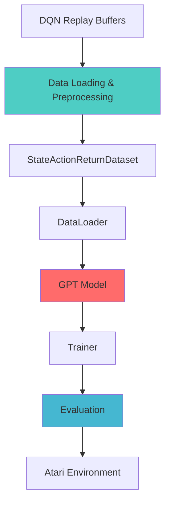

## 2. 데이터 파이프라인 상세

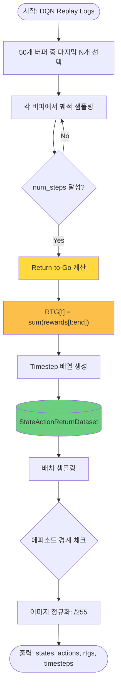

### RTG 계산 세부 과정

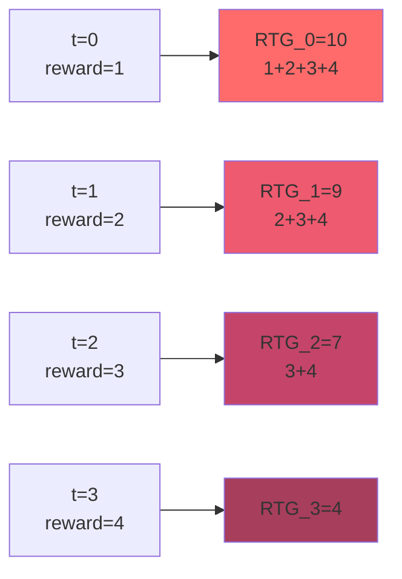

## 3. GPT 모델 아키텍처

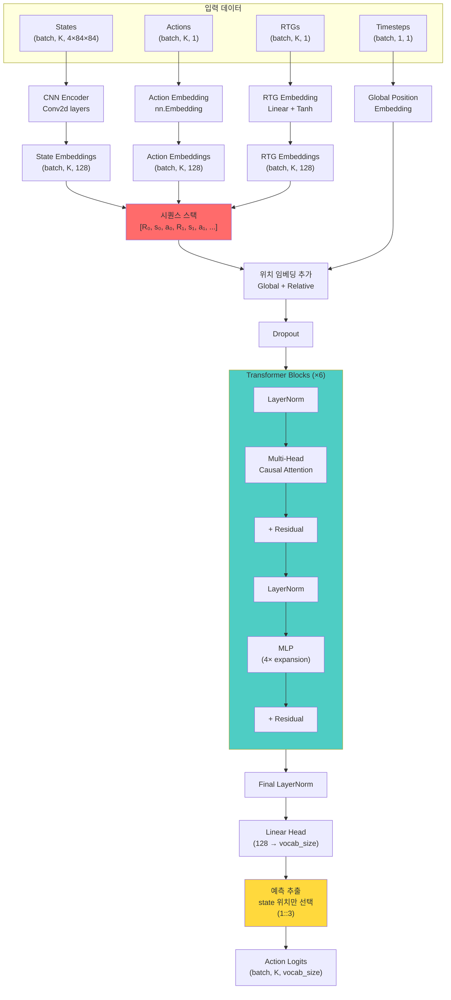

### CNN Encoder 세부 구조

```mermaid
flowchart LR
    Input["Input<br/>(4, 84, 84)"] --> Conv1["Conv2d<br/>kernel=8, stride=4<br/>4→32 channels"]
    Conv1 --> ReLU1[ReLU]
    ReLU1 --> Output1["(32, 20, 20)"]

    Output1 --> Conv2["Conv2d<br/>kernel=4, stride=2<br/>32→64 channels"]
    Conv2 --> ReLU2[ReLU]
    ReLU2 --> Output2["(64, 9, 9)"]

    Output2 --> Conv3["Conv2d<br/>kernel=3, stride=1<br/>64→64 channels"]
    Conv3 --> ReLU3[ReLU]
    ReLU3 --> Output3["(64, 7, 7)"]

    Output3 --> Flatten["Flatten<br/>3136"]
    Flatten --> Linear["Linear<br/>3136→128"]
    Linear --> Tanh[Tanh]
    Tanh --> FinalOutput["Output<br/>(128,)"]

    style Input fill:#e3f2fd
    style FinalOutput fill:#c8e6c9
```

## 4. 학습 루프

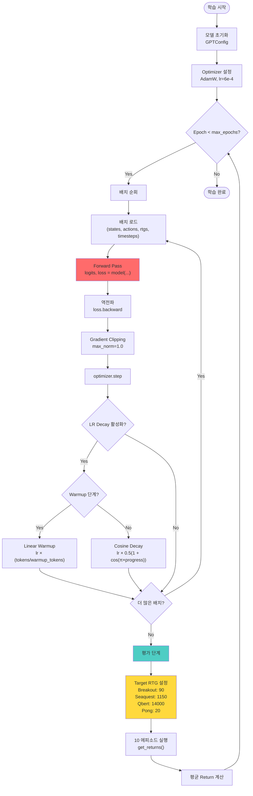

### Learning Rate 스케줄

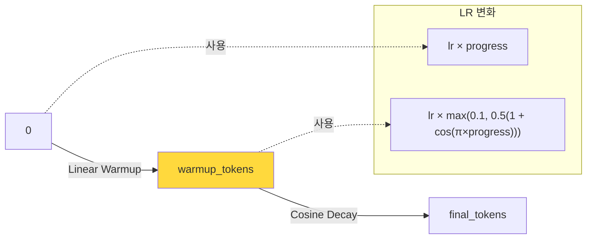

## 5. 평가 (추론) 과정

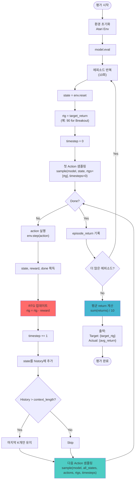

### RTG 동적 업데이트 예시

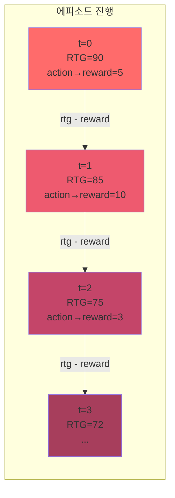

## 6. 모델별 시퀀스 구성 비교

### Reward-Conditioned (Decision Transformer)

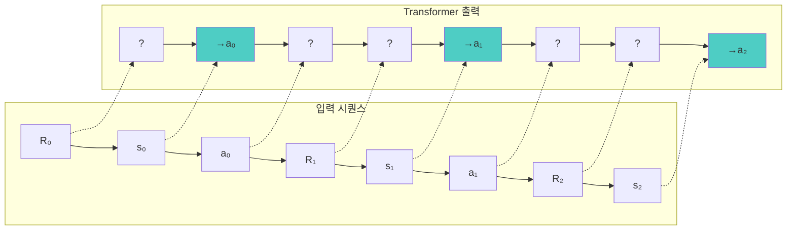

**핵심:** State 위치 (1::3)에서만 action 예측 추출

### Naive (Behavior Cloning)

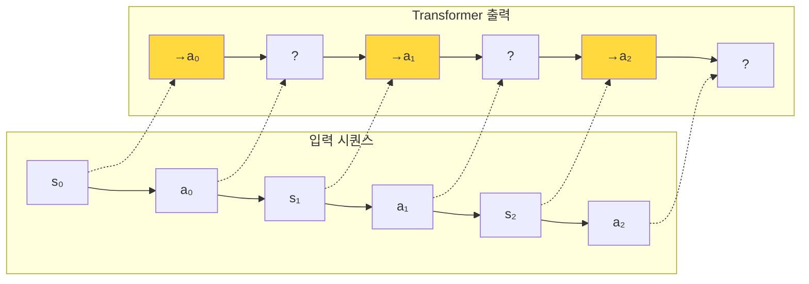

**핵심:** State 위치 (0::2)에서 action 예측 추출, RTG 없음

## 7. Causal Attention Masking

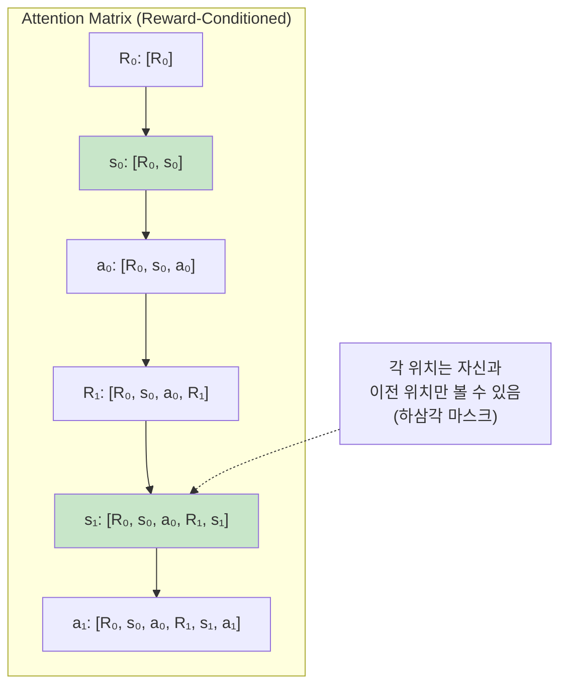

**예시:** s₁ 위치에서 a₁을 예측할 때, [R₀, s₀, a₀, R₁, s₁]까지 모두 참조 가능

## 8. 샘플링 프로세스

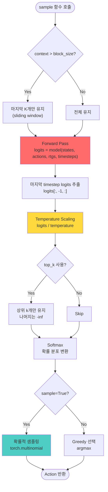

## 9. 전체 시스템 데이터 플로우

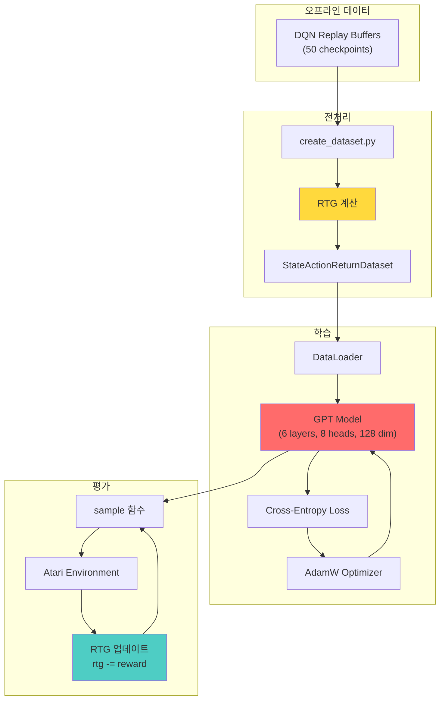

## 10. 핵심 개념 요약

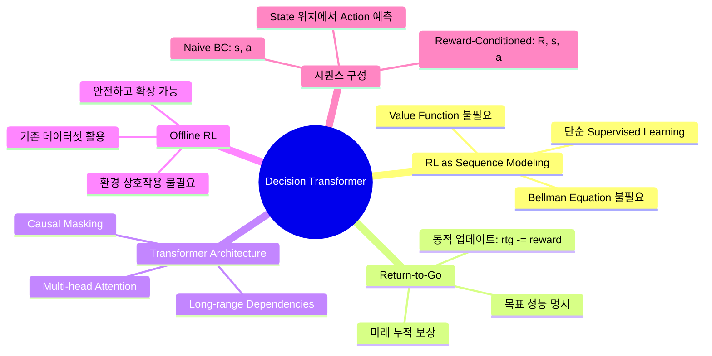

## 11. 모델 타입별 차이점

| 특성 | Reward-Conditioned (DT) | Naive (BC) |
|------|------------------------|-----------|
| **입력 시퀀스** | [R₀, s₀, a₀, R₁, s₁, a₁, ...] | [s₀, a₀, s₁, a₁, ...] |
| **시퀀스 길이** | K × 3 | K × 2 |
| **예측 위치** | 1::3 (state 위치) | 0::2 (state 위치) |
| **조건화** | RTG로 목표 return 지정 | 조건 없음 |
| **평가 RTG** | 게임별 목표값 (Breakout: 90) | 0 (무시됨) |
| **추론 시 RTG** | 동적 업데이트 | 사용 안 함 |

## 12. 하이퍼파라미터 요약

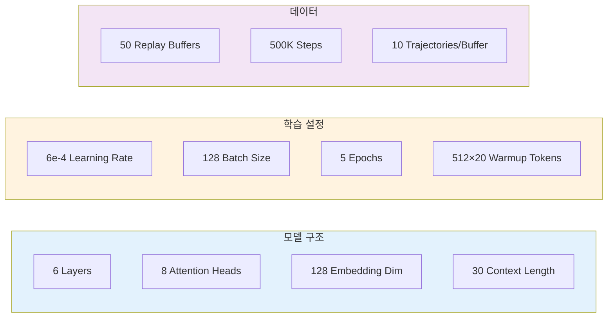

---

## 참고 자료

- **논문:** [Decision Transformer: Reinforcement Learning via Sequence Modeling](https://arxiv.org/abs/2106.01345)
- **코드:** [decision-transformer/atari/](../atari/)
- **주요 파일:**
  - [run_dt_atari.py](../atari/run_dt_atari.py): 메인 실행 스크립트
  - [model_atari.py](../atari/mingpt/model_atari.py): GPT 모델 구현
  - [trainer_atari.py](../atari/mingpt/trainer_atari.py): 학습 및 평가 루프
  - [create_dataset.py](../atari/create_dataset.py): 데이터셋 생성 및 RTG 계산
  - [utils.py](../atari/mingpt/utils.py): 샘플링 함수
