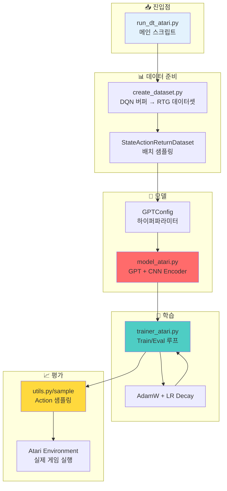
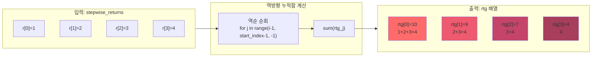
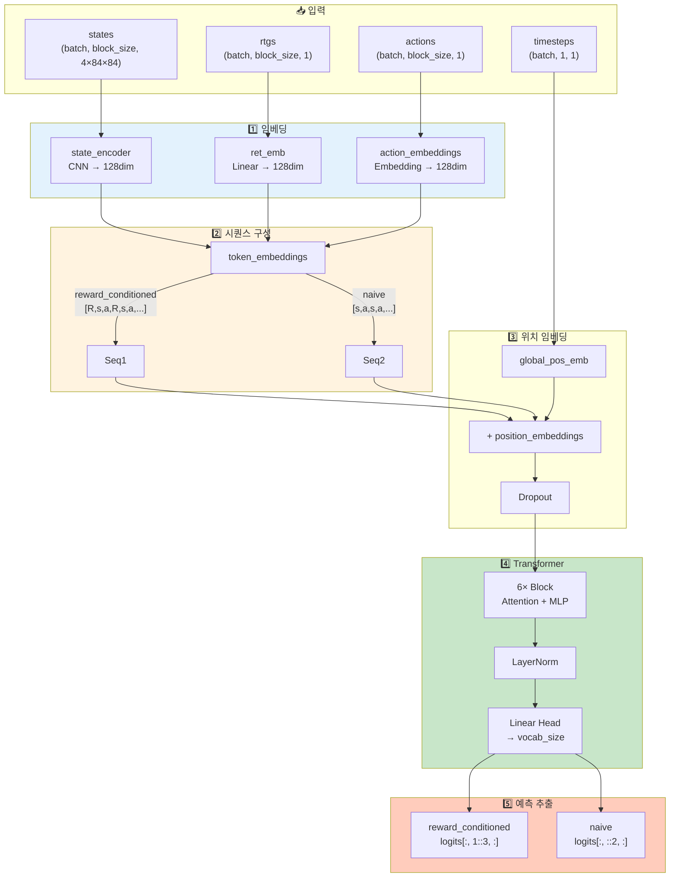
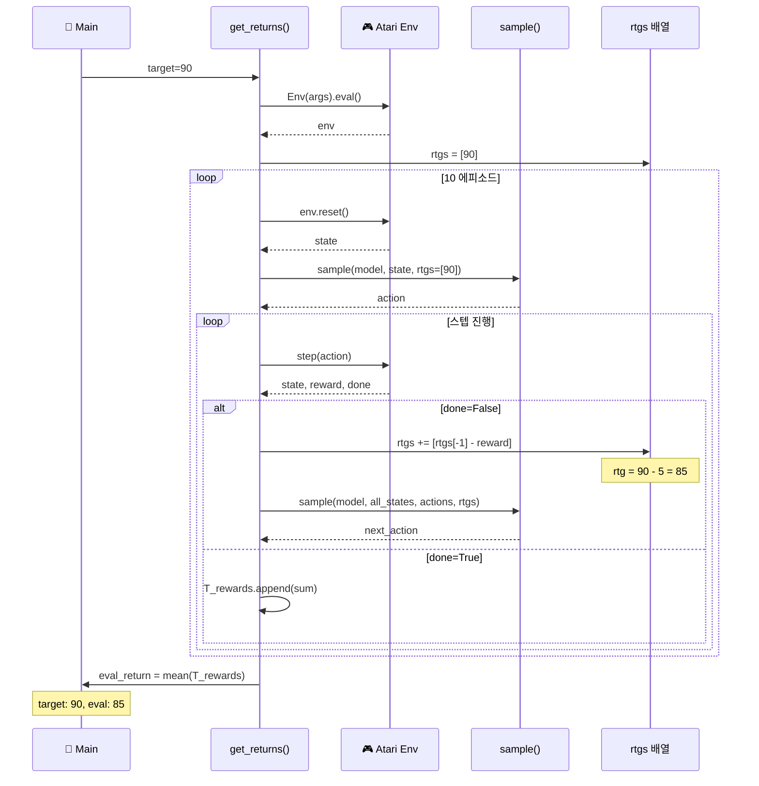

# Decision Transformer 코드 상세 분석

이 문서는 Decision Transformer (Atari)의 주요 코드 구현을 단계별로 설명합니다.

## 목차

1. [메인 실행 흐름](#1-메인-실행-흐름)
2. [데이터셋 생성](#2-데이터셋-생성)
3. [GPT 모델 구현](#3-gpt-모델-구현)
4. [학습 루프](#4-학습-루프)
5. [평가 및 샘플링](#5-평가-및-샘플링)

---

## 전체 코드 실행 흐름 개요



---

## 1. 메인 실행 흐름

**파일:** `atari/run_dt_atari.py`

### 1.1 설정 파라미터

```python
parser = argparse.ArgumentParser()
parser.add_argument('--seed', type=int, default=123)
parser.add_argument('--context_length', type=int, default=30)  # K: 컨텍스트 윈도우
parser.add_argument('--epochs', type=int, default=5)
parser.add_argument('--model_type', type=str, default='reward_conditioned')  # 'naive' 또는 'reward_conditioned'
parser.add_argument('--num_steps', type=int, default=500000)  # 로드할 전체 스텝 수
parser.add_argument('--num_buffers', type=int, default=50)    # 사용할 버퍼 수
parser.add_argument('--game', type=str, default='Breakout')
parser.add_argument('--batch_size', type=int, default=128)
parser.add_argument('--trajectories_per_buffer', type=int, default=10)
parser.add_argument('--data_dir_prefix', type=str, default='./dqn_replay/')
```

**핵심 파라미터:**
- `context_length`: 모델이 볼 수 있는 타임스텝 수 (기본 30)
- `block_size`: `context_length * 3` - (R, s, a) 트리플이므로 실제 토큰 수는 3배
- `model_type`:
  - `'reward_conditioned'`: Decision Transformer (RTG 조건화)
  - `'naive'`: Behavior Cloning (RTG 없음)

### 1.2 데이터셋 클래스

```python
class StateActionReturnDataset(Dataset):
    def __init__(self, data, block_size, actions, done_idxs, rtgs, timesteps):
        self.block_size = block_size  # context_length * 3
        self.vocab_size = max(actions) + 1  # 행동 공간 크기
        self.data = data           # 관측 (이미지)
        self.actions = actions     # 행동
        self.done_idxs = done_idxs # 에피소드 종료 인덱스
        self.rtgs = rtgs           # Return-to-go
        self.timesteps = timesteps # 타임스텝
```

**`__getitem__` 메서드 - 배치 샘플링:**

```python
def __getitem__(self, idx):
    # block_size는 토큰 수 (R, s, a 포함)이므로, 실제 타임스텝은 1/3
    block_size = self.block_size // 3  # 예: 90 // 3 = 30 타임스텝
    done_idx = idx + block_size

    # 에피소드 경계를 넘지 않도록 조정
    for i in self.done_idxs:
        if i > idx:  # 현재 인덱스 이후 첫 번째 done
            done_idx = min(int(i), done_idx)
            break

    # 실제 시작 인덱스 재조정
    idx = done_idx - block_size

    # States: (block_size, 4*84*84) → 정규화
    states = torch.tensor(np.array(self.data[idx:done_idx]), dtype=torch.float32)
    states = states.reshape(block_size, -1)
    states = states / 255.  # [0, 1]로 정규화

    # Actions: (block_size, 1)
    actions = torch.tensor(self.actions[idx:done_idx], dtype=torch.long).unsqueeze(1)

    # RTGs: (block_size, 1)
    rtgs = torch.tensor(self.rtgs[idx:done_idx], dtype=torch.float32).unsqueeze(1)

    # Timesteps: (1, 1) - 시퀀스 시작 timestep만
    timesteps = torch.tensor(self.timesteps[idx:idx+1], dtype=torch.int64).unsqueeze(1)

    return states, actions, rtgs, timesteps
```

**중요 포인트:**
1. **에피소드 경계 처리**: 샘플이 여러 에피소드를 넘어가지 않도록 보장
2. **이미지 정규화**: [0, 255] → [0, 1]
3. **Timestep 처리**: 시퀀스당 하나의 timestep만 사용 (시작 timestep)

### 1.3 모델 및 트레이너 초기화

```python
# 데이터 로드
obss, actions, returns, done_idxs, rtgs, timesteps = create_dataset(
    args.num_buffers, args.num_steps, args.game,
    args.data_dir_prefix, args.trajectories_per_buffer
)

# 데이터셋 생성
train_dataset = StateActionReturnDataset(
    obss,
    args.context_length * 3,  # block_size
    actions,
    done_idxs,
    rtgs,
    timesteps
)

# 모델 설정
mconf = GPTConfig(
    train_dataset.vocab_size,  # 행동 공간 크기
    train_dataset.block_size,  # 시퀀스 길이
    n_layer=6,                 # Transformer layers
    n_head=8,                  # Attention heads
    n_embd=128,                # Embedding dimension
    model_type=args.model_type,
    max_timestep=max(timesteps)
)
model = GPT(mconf)

# 트레이너 설정
tconf = TrainerConfig(
    max_epochs=args.epochs,
    batch_size=args.batch_size,
    learning_rate=6e-4,
    lr_decay=True,
    warmup_tokens=512*20,
    final_tokens=2*len(train_dataset)*args.context_length*3,
    num_workers=4,
    seed=args.seed,
    model_type=args.model_type,
    game=args.game,
    max_timestep=max(timesteps)
)
trainer = Trainer(model, train_dataset, None, tconf)

# 학습 시작
trainer.train()
```

---

## 2. 데이터셋 생성

**파일:** `atari/create_dataset.py`

### 2.1 DQN Replay 버퍼 로딩

```python
def create_dataset(num_buffers, num_steps, game, data_dir_prefix, trajectories_per_buffer):
    # 데이터 저장소
    obss = []           # 관측 (4×84×84 프레임 스택)
    actions = []        # 행동
    returns = [0]       # 에피소드별 총 return
    done_idxs = []      # 에피소드 종료 인덱스
    stepwise_returns = []  # 각 스텝의 즉각 보상

    transitions_per_buffer = np.zeros(50, dtype=int)
    num_trajectories = 0

    # num_steps에 도달할 때까지 데이터 로드
    while len(obss) < num_steps:
        # 마지막 num_buffers개 버퍼 중 랜덤 선택 (더 나은 정책)
        buffer_num = np.random.choice(np.arange(50 - num_buffers, 50), 1)[0]
        i = transitions_per_buffer[buffer_num]

        # FixedReplayBuffer 로드
        frb = FixedReplayBuffer(
            data_dir=data_dir_prefix + game + '/1/replay_logs',
            replay_suffix=buffer_num,
            observation_shape=(84, 84),
            stack_size=4,          # 4 프레임 스택
            update_horizon=1,
            gamma=0.99,
            observation_dtype=np.uint8,
            batch_size=32,
            replay_capacity=100000
        )

        if frb._loaded_buffers:
            done = False
            curr_num_transitions = len(obss)
            trajectories_to_load = trajectories_per_buffer

            # 궤적 샘플링 루프
            while not done:
                # 전이 샘플링
                states, ac, ret, next_states, next_action, next_reward, terminal, indices = \
                    frb.sample_transition_batch(batch_size=1, indices=[i])

                # (1, 84, 84, 4) → (4, 84, 84)
                states = states.transpose((0, 3, 1, 2))[0]

                obss += [states]
                actions += [ac[0]]
                stepwise_returns += [ret[0]]

                # 에피소드 종료 처리
                if terminal[0]:
                    done_idxs += [len(obss)]
                    returns += [0]
                    if trajectories_to_load == 0:
                        done = True
                    else:
                        trajectories_to_load -= 1

                returns[-1] += ret[0]  # 누적 return
                i += 1

                # 버퍼 용량 초과 체크
                if i >= 100000:
                    obss = obss[:curr_num_transitions]
                    actions = actions[:curr_num_transitions]
                    stepwise_returns = stepwise_returns[:curr_num_transitions]
                    returns[-1] = 0
                    i = transitions_per_buffer[buffer_num]
                    done = True

            num_trajectories += (trajectories_per_buffer - trajectories_to_load)
            transitions_per_buffer[buffer_num] = i
```

### 2.2 Return-to-Go (RTG) 계산 - 핵심!



```python
# RTG 계산: 각 타임스텝에서 에피소드 끝까지의 누적 보상
start_index = 0
rtg = np.zeros_like(stepwise_returns)

for i in done_idxs:
    i = int(i)
    curr_traj_returns = stepwise_returns[start_index:i]

    # 역방향 순회: 끝에서 시작으로
    for j in range(i-1, start_index-1, -1):
        # j부터 에피소드 끝까지의 보상 합산
        rtg_j = curr_traj_returns[j-start_index:i-start_index]
        rtg[j] = sum(rtg_j)

    start_index = i

print('max rtg is %d' % max(rtg))
```

**RTG 계산 예시:**

```
타임스텝:  0    1    2    3    (done)
보상:      1    2    3    4
---------------------------------
RTG[3] = 4                      (마지막)
RTG[2] = 3 + 4 = 7
RTG[1] = 2 + 3 + 4 = 9
RTG[0] = 1 + 2 + 3 + 4 = 10    (처음)
```

**의미:** RTG[t]는 "타임스텝 t부터 에피소드 끝까지 얻을 수 있는 총 보상"

### 2.3 Timestep 생성

```python
# 각 에피소드마다 0부터 다시 시작하는 timestep
start_index = 0
timesteps = np.zeros(len(actions)+1, dtype=int)

for i in done_idxs:
    i = int(i)
    # 해당 에피소드의 timestep: 0, 1, 2, ..., length-1
    timesteps[start_index:i+1] = np.arange(i+1 - start_index)
    start_index = i+1

print('max timestep is %d' % max(timesteps))

return obss, actions, returns, done_idxs, rtg, timesteps
```

---

## 3. GPT 모델 구현

**파일:** `atari/mingpt/model_atari.py`

### 3.1 GPT Config

```python
class GPTConfig:
    embd_pdrop = 0.1   # Embedding dropout
    resid_pdrop = 0.1  # Residual dropout
    attn_pdrop = 0.1   # Attention dropout

    def __init__(self, vocab_size, block_size, **kwargs):
        self.vocab_size = vocab_size  # 행동 공간 크기
        self.block_size = block_size  # 시퀀스 길이 (context_length * 3)
        for k,v in kwargs.items():
            setattr(self, k, v)
```

### 3.2 Causal Self-Attention

```python
class CausalSelfAttention(nn.Module):
    def __init__(self, config):
        super().__init__()
        assert config.n_embd % config.n_head == 0

        # Q, K, V projections
        self.key = nn.Linear(config.n_embd, config.n_embd)
        self.query = nn.Linear(config.n_embd, config.n_embd)
        self.value = nn.Linear(config.n_embd, config.n_embd)

        # Dropout
        self.attn_drop = nn.Dropout(config.attn_pdrop)
        self.resid_drop = nn.Dropout(config.resid_pdrop)

        # Output projection
        self.proj = nn.Linear(config.n_embd, config.n_embd)

        # Causal mask (하삼각 행렬)
        self.register_buffer(
            "mask",
            torch.tril(torch.ones(config.block_size + 1, config.block_size + 1))
                 .view(1, 1, config.block_size + 1, config.block_size + 1)
        )
        self.n_head = config.n_head

    def forward(self, x, layer_past=None):
        B, T, C = x.size()  # Batch, Time, Channels

        # Multi-head attention
        k = self.key(x).view(B, T, self.n_head, C // self.n_head).transpose(1, 2)
        q = self.query(x).view(B, T, self.n_head, C // self.n_head).transpose(1, 2)
        v = self.value(x).view(B, T, self.n_head, C // self.n_head).transpose(1, 2)

        # Attention scores
        att = (q @ k.transpose(-2, -1)) * (1.0 / math.sqrt(k.size(-1)))

        # Causal masking: 미래 토큰은 볼 수 없음
        att = att.masked_fill(self.mask[:,:,:T,:T] == 0, float('-inf'))
        att = F.softmax(att, dim=-1)
        att = self.attn_drop(att)

        # Attention output
        y = att @ v
        y = y.transpose(1, 2).contiguous().view(B, T, C)

        # Output projection
        y = self.resid_drop(self.proj(y))
        return y
```

### 3.3 Transformer Block

```python
class Block(nn.Module):
    def __init__(self, config):
        super().__init__()
        self.ln1 = nn.LayerNorm(config.n_embd)
        self.ln2 = nn.LayerNorm(config.n_embd)
        self.attn = CausalSelfAttention(config)

        # MLP: 4배 확장 후 축소
        self.mlp = nn.Sequential(
            nn.Linear(config.n_embd, 4 * config.n_embd),
            GELU(),
            nn.Linear(4 * config.n_embd, config.n_embd),
            nn.Dropout(config.resid_pdrop),
        )

    def forward(self, x):
        # Pre-LayerNorm + Residual
        x = x + self.attn(self.ln1(x))
        x = x + self.mlp(self.ln2(x))
        return x
```

### 3.4 GPT 메인 클래스

```python
class GPT(nn.Module):
    def __init__(self, config):
        super().__init__()
        self.config = config
        self.model_type = config.model_type

        # 기본 GPT 구조
        self.tok_emb = nn.Embedding(config.vocab_size, config.n_embd)
        self.pos_emb = nn.Parameter(torch.zeros(1, config.block_size + 1, config.n_embd))
        self.global_pos_emb = nn.Parameter(torch.zeros(1, config.max_timestep+1, config.n_embd))
        self.drop = nn.Dropout(config.embd_pdrop)

        # Transformer blocks
        self.blocks = nn.Sequential(*[Block(config) for _ in range(config.n_layer)])
        self.ln_f = nn.LayerNorm(config.n_embd)
        self.head = nn.Linear(config.n_embd, config.vocab_size, bias=False)

        self.block_size = config.block_size
        self.apply(self._init_weights)

        # Decision Transformer 전용 인코더
        # State encoder: DQN 스타일 CNN
        self.state_encoder = nn.Sequential(
            nn.Conv2d(4, 32, 8, stride=4, padding=0), nn.ReLU(),   # (4, 84, 84) → (32, 20, 20)
            nn.Conv2d(32, 64, 4, stride=2, padding=0), nn.ReLU(),  # (32, 20, 20) → (64, 9, 9)
            nn.Conv2d(64, 64, 3, stride=1, padding=0), nn.ReLU(),  # (64, 9, 9) → (64, 7, 7)
            nn.Flatten(),                                           # 64*7*7 = 3136
            nn.Linear(3136, config.n_embd),                        # 3136 → 128
            nn.Tanh()
        )

        # RTG encoder
        self.ret_emb = nn.Sequential(
            nn.Linear(1, config.n_embd),
            nn.Tanh()
        )

        # Action encoder
        self.action_embeddings = nn.Sequential(
            nn.Embedding(config.vocab_size, config.n_embd),
            nn.Tanh()
        )
        nn.init.normal_(self.action_embeddings[0].weight, mean=0.0, std=0.02)
```

### 3.5 Forward Pass - 핵심!



```python
def forward(self, states, actions, targets=None, rtgs=None, timesteps=None):
    """
    Args:
        states: (batch, block_size, 4*84*84)
        actions: (batch, block_size, 1)
        targets: (batch, block_size, 1) - 학습 시 action labels
        rtgs: (batch, block_size, 1)
        timesteps: (batch, 1, 1)
    """

    # Step 1: State 임베딩
    # (batch, block_size, 4*84*84) → (batch*block_size, 4, 84, 84)
    state_embeddings = self.state_encoder(
        states.reshape(-1, 4, 84, 84).type(torch.float32).contiguous()
    )
    # (batch*block_size, n_embd) → (batch, block_size, n_embd)
    state_embeddings = state_embeddings.reshape(
        states.shape[0], states.shape[1], self.config.n_embd
    )

    # Step 2: 시퀀스 구성
    if actions is not None and self.model_type == 'reward_conditioned':
        # RTG와 Action 임베딩
        rtg_embeddings = self.ret_emb(rtgs.type(torch.float32))
        action_embeddings = self.action_embeddings(actions.type(torch.long).squeeze(-1))

        # (R, s, a) 트리플 시퀀스 생성
        token_embeddings = torch.zeros(
            (states.shape[0], states.shape[1]*3 - int(targets is None), self.config.n_embd),
            dtype=torch.float32,
            device=state_embeddings.device
        )
        token_embeddings[:,::3,:] = rtg_embeddings      # 위치 0, 3, 6, ... (RTG)
        token_embeddings[:,1::3,:] = state_embeddings   # 위치 1, 4, 7, ... (State)
        token_embeddings[:,2::3,:] = action_embeddings[:,-states.shape[1] + int(targets is None):,:]  # 위치 2, 5, 8, ... (Action)

    elif actions is None and self.model_type == 'reward_conditioned':
        # 첫 타임스텝 (action 없음)
        rtg_embeddings = self.ret_emb(rtgs.type(torch.float32))
        token_embeddings = torch.zeros(
            (states.shape[0], states.shape[1]*2, self.config.n_embd),
            dtype=torch.float32,
            device=state_embeddings.device
        )
        token_embeddings[:,::2,:] = rtg_embeddings   # [R₀, s₀]
        token_embeddings[:,1::2,:] = state_embeddings

    elif actions is not None and self.model_type == 'naive':
        # Behavior Cloning: (s, a) 시퀀스만
        action_embeddings = self.action_embeddings(actions.type(torch.long).squeeze(-1))
        token_embeddings = torch.zeros(
            (states.shape[0], states.shape[1]*2 - int(targets is None), self.config.n_embd),
            dtype=torch.float32,
            device=state_embeddings.device
        )
        token_embeddings[:,::2,:] = state_embeddings
        token_embeddings[:,1::2,:] = action_embeddings[:,-states.shape[1] + int(targets is None):,:]

    elif actions is None and self.model_type == 'naive':
        # 첫 타임스텝
        token_embeddings = state_embeddings

    else:
        raise NotImplementedError()

    # Step 3: 위치 임베딩
    batch_size = states.shape[0]
    all_global_pos_emb = torch.repeat_interleave(self.global_pos_emb, batch_size, dim=0)

    # Global (absolute) + Relative position embeddings
    position_embeddings = torch.gather(
        all_global_pos_emb, 1,
        torch.repeat_interleave(timesteps, self.config.n_embd, dim=-1)
    ) + self.pos_emb[:, :token_embeddings.shape[1], :]

    # Step 4: Transformer 처리
    x = self.drop(token_embeddings + position_embeddings)
    x = self.blocks(x)  # 6개 transformer blocks
    x = self.ln_f(x)
    logits = self.head(x)  # (batch, seq_len, vocab_size)

    # Step 5: Action 예측 추출
    if actions is not None and self.model_type == 'reward_conditioned':
        # State 위치 (1::3)에서만 예측 추출
        # [?, →a₀, ?, ?, →a₁, ?, ?, →a₂, ...]
        logits = logits[:, 1::3, :]
    elif actions is None and self.model_type == 'reward_conditioned':
        logits = logits[:, 1:, :]
    elif actions is not None and self.model_type == 'naive':
        # State 위치 (0::2)에서 예측 추출
        logits = logits[:, ::2, :]
    elif actions is None and self.model_type == 'naive':
        logits = logits
    else:
        raise NotImplementedError()

    # Step 6: 손실 계산
    loss = None
    if targets is not None:
        loss = F.cross_entropy(
            logits.reshape(-1, logits.size(-1)),
            targets.reshape(-1)
        )

    return logits, loss
```

**핵심 포인트:**

1. **시퀀스 구성:**
   - Reward-conditioned: `[R₀, s₀, a₀, R₁, s₁, a₁, ...]`
   - Naive: `[s₀, a₀, s₁, a₁, ...]`

2. **예측 위치:**
   - State 토큰 위치에서 action 예측
   - Causal masking으로 인해 s₀는 R₀만 보고, s₁은 R₀, s₀, a₀, R₁까지 볼 수 있음

3. **위치 인코딩:**
   - Global: 에피소드 내 절대 timestep
   - Relative: 컨텍스트 윈도우 내 상대 위치

---

## 4. 학습 루프

**파일:** `atari/mingpt/trainer_atari.py`

### 4.1 학습 Epoch

```python
def run_epoch(split, epoch_num=0):
    is_train = split == 'train'
    model.train(is_train)
    data = self.train_dataset if is_train else self.test_dataset
    loader = DataLoader(
        data,
        shuffle=True,
        pin_memory=True,
        batch_size=config.batch_size,
        num_workers=config.num_workers
    )

    losses = []
    pbar = tqdm(enumerate(loader), total=len(loader)) if is_train else enumerate(loader)

    for it, (x, y, r, t) in pbar:
        # 데이터 GPU로 이동
        x = x.to(self.device)  # states
        y = y.to(self.device)  # actions
        r = r.to(self.device)  # rtgs
        t = t.to(self.device)  # timesteps

        # Forward pass
        with torch.set_grad_enabled(is_train):
            logits, loss = model(x, y, y, r, t)  # targets=y (action labels)
            loss = loss.mean()
            losses.append(loss.item())

        if is_train:
            # 역전파
            model.zero_grad()
            loss.backward()

            # Gradient clipping
            torch.nn.utils.clip_grad_norm_(model.parameters(), config.grad_norm_clip)

            # Optimizer step
            optimizer.step()

            # Learning rate decay
            if config.lr_decay:
                self.tokens += (y >= 0).sum()  # 처리된 토큰 수

                if self.tokens < config.warmup_tokens:
                    # Linear warmup
                    lr_mult = float(self.tokens) / float(max(1, config.warmup_tokens))
                else:
                    # Cosine decay
                    progress = float(self.tokens - config.warmup_tokens) / \
                               float(max(1, config.final_tokens - config.warmup_tokens))
                    lr_mult = max(0.1, 0.5 * (1.0 + math.cos(math.pi * progress)))

                lr = config.learning_rate * lr_mult
                for param_group in optimizer.param_groups:
                    param_group['lr'] = lr
            else:
                lr = config.learning_rate

            # 진행 상황 출력
            pbar.set_description(
                f"epoch {epoch+1} iter {it}: train loss {loss.item():.5f}. lr {lr:e}"
            )
```

### 4.2 메인 학습 루프

```python
def train(self):
    model, config = self.model, self.config
    raw_model = model.module if hasattr(self.model, "module") else model
    optimizer = raw_model.configure_optimizers(config)

    best_return = -float('inf')
    self.tokens = 0  # LR decay용 토큰 카운터

    for epoch in range(config.max_epochs):
        # 학습
        run_epoch('train', epoch_num=epoch)

        # 평가: 목표 RTG로 조건화
        if self.config.model_type == 'naive':
            eval_return = self.get_returns(0)  # BC는 RTG 무시
        elif self.config.model_type == 'reward_conditioned':
            # 게임별 목표 return
            if self.config.game == 'Breakout':
                eval_return = self.get_returns(90)
            elif self.config.game == 'Seaquest':
                eval_return = self.get_returns(1150)
            elif self.config.game == 'Qbert':
                eval_return = self.get_returns(14000)
            elif self.config.game == 'Pong':
                eval_return = self.get_returns(20)
            else:
                raise NotImplementedError()
```

---

## 5. 평가 및 샘플링

### 5.1 평가 함수 - get_returns



```python
def get_returns(self, ret):
    """
    Args:
        ret: 목표 return (예: Breakout의 경우 90)
    Returns:
        eval_return: 10 에피소드의 평균 return
    """
    self.model.train(False)
    args = Args(self.config.game.lower(), self.config.seed)
    env = Env(args)
    env.eval()

    T_rewards = []

    for i in range(10):  # 10 에피소드 평가
        state = env.reset()
        state = state.type(torch.float32).to(self.device).unsqueeze(0).unsqueeze(0)
        rtgs = [ret]  # 초기 목표 RTG

        # 첫 번째 action 샘플링
        sampled_action = sample(
            self.model.module,
            state,
            1,
            temperature=1.0,
            sample=True,
            actions=None,
            rtgs=torch.tensor(rtgs, dtype=torch.long).to(self.device).unsqueeze(0).unsqueeze(-1),
            timesteps=torch.zeros((1, 1, 1), dtype=torch.int64).to(self.device)
        )

        j = 0
        all_states = state
        actions = []
        reward_sum = 0
        done = False

        # 에피소드 롤아웃
        while True:
            if done:
                state, reward_sum, done = env.reset(), 0, False

            # Action 실행
            action = sampled_action.cpu().numpy()[0,-1]
            actions += [sampled_action]
            state, reward, done = env.step(action)
            reward_sum += reward
            j += 1

            if done:
                T_rewards.append(reward_sum)
                break

            # State history 업데이트
            state = state.unsqueeze(0).unsqueeze(0).to(self.device)
            all_states = torch.cat([all_states, state], dim=0)

            # RTG 업데이트 - 핵심!
            rtgs += [rtgs[-1] - reward]

            # 다음 action 샘플링
            sampled_action = sample(
                self.model.module,
                all_states.unsqueeze(0),
                1,
                temperature=1.0,
                sample=True,
                actions=torch.tensor(actions, dtype=torch.long).to(self.device).unsqueeze(1).unsqueeze(0),
                rtgs=torch.tensor(rtgs, dtype=torch.long).to(self.device).unsqueeze(0).unsqueeze(-1),
                timesteps=(min(j, self.config.max_timestep) * torch.ones((1, 1, 1), dtype=torch.int64).to(self.device))
            )

    env.close()
    eval_return = sum(T_rewards) / 10.
    print("target return: %d, eval return: %d" % (ret, eval_return))
    self.model.train(True)
    return eval_return
```

**핵심: RTG 동적 업데이트**

```python
rtgs += [rtgs[-1] - reward]
```

**예시:**
```
초기: rtg = 90 (목표)
스텝 1: reward = 5 → rtg = 90 - 5 = 85
스텝 2: reward = 10 → rtg = 85 - 10 = 75
스텝 3: reward = 3 → rtg = 75 - 3 = 72
...
```

이렇게 RTG는 "아직 얻어야 할 보상"을 나타냅니다!

### 5.2 샘플링 함수

**파일:** `atari/mingpt/utils.py`

```python
@torch.no_grad()
def sample(model, x, steps, temperature=1.0, sample=False, top_k=None,
           actions=None, rtgs=None, timesteps=None):
    """
    Args:
        model: GPT 모델
        x: states (batch, seq_len, ...)
        steps: 샘플링할 스텝 수 (일반적으로 1)
        temperature: 온도 파라미터 (높을수록 탐험적)
        sample: True면 확률적, False면 greedy
        top_k: Top-k 샘플링
        actions: 이전 actions
        rtgs: Return-to-go
        timesteps: 현재 timestep
    Returns:
        sampled_action: 샘플링된 action
    """
    block_size = model.get_block_size()
    model.eval()

    for k in range(steps):
        # Context window 크기 제한
        # block_size는 토큰 수이므로 실제 타임스텝은 1/3
        x_cond = x if x.size(1) <= block_size//3 else x[:, -block_size//3:]

        if actions is not None:
            actions = actions if actions.size(1) <= block_size//3 else actions[:, -block_size//3:]

        rtgs = rtgs if rtgs.size(1) <= block_size//3 else rtgs[:, -block_size//3:]

        # Forward pass
        logits, _ = model(x_cond, actions=actions, targets=None, rtgs=rtgs, timesteps=timesteps)

        # 마지막 타임스텝의 logits만 사용
        logits = logits[:, -1, :] / temperature

        # Top-k 샘플링 (옵션)
        if top_k is not None:
            logits = top_k_logits(logits, top_k)

        # Softmax로 확률 분포 변환
        probs = F.softmax(logits, dim=-1)

        # 샘플링 vs Greedy
        if sample:
            # 확률적 샘플링
            ix = torch.multinomial(probs, num_samples=1)
        else:
            # Greedy (argmax)
            _, ix = torch.topk(probs, k=1, dim=-1)

        x = ix  # 샘플링된 action

    return x
```

**Top-k 필터링:**

```python
def top_k_logits(logits, k):
    """상위 k개를 제외한 나머지 logits를 -inf로 설정"""
    v, ix = torch.topk(logits, k)
    out = logits.clone()
    out[out < v[:, [-1]]] = -float('Inf')
    return out
```

---

## 핵심 개념 정리

### 1. Decision Transformer의 혁신

**기존 RL:**
```
Q-learning: Q(s,a) = r + γ max Q(s',a')
Policy Gradient: ∇J(θ) = E[∇ log π(a|s) A(s,a)]
```

**Decision Transformer:**
```
Supervised Learning: π(a|s, R) = GPT(R, s₀, a₀, ..., R, s)
단순히 (R, s, a) 시퀀스를 모델링!
```

### 2. RTG의 역할

**학습 시:** RTG는 데이터에서 계산된 실제 미래 누적 보상
```python
rtg[t] = sum(rewards[t:end])
```

**추론 시:** RTG는 원하는 목표를 지정하고 동적으로 업데이트
```python
rtg = target_return  # 예: 90
while not done:
    action = model(state, rtg)
    state, reward, done = env.step(action)
    rtg = rtg - reward  # 업데이트!
```

### 3. 왜 State 위치에서 예측?

Causal masking 덕분:
```
입력:  [R₀, s₀, a₀, R₁, s₁, a₁, ...]
예측:  [  ,   , a₀,   ,   , a₁, ...]
```

- s₀ 위치: R₀, s₀만 볼 수 있음 → a₀ 예측
- s₁ 위치: R₀, s₀, a₀, R₁, s₁까지 볼 수 있음 → a₁ 예측

### 4. 모델 타입 비교

| | Reward-Conditioned | Naive |
|---|---|---|
| **시퀀스** | [R, s, a] | [s, a] |
| **조건화** | RTG로 목표 지정 | 없음 |
| **유연성** | 다양한 성능 수준 | 고정된 정책 |
| **사용 사례** | 원하는 return 달성 | 단순 모방 학습 |

---

## 실행 예시

### 학습

```bash
cd atari
python run_dt_atari.py \
  --seed 123 \
  --context_length 30 \
  --epochs 5 \
  --model_type 'reward_conditioned' \
  --num_steps 500000 \
  --num_buffers 50 \
  --game 'Breakout' \
  --batch_size 128 \
  --data_dir_prefix ./dqn_replay
```

### 여러 실험 실행

```bash
cd atari
bash run.sh
```

---

이 문서는 Decision Transformer (Atari)의 전체 코드 구현을 상세히 설명합니다. 각 함수의 역할과 데이터 흐름을 이해하면 Decision Transformer의 핵심 아이디어를 완전히 파악할 수 있습니다!
