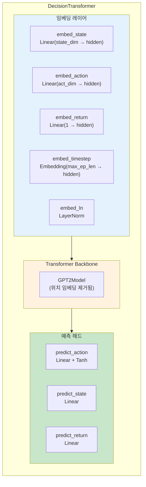
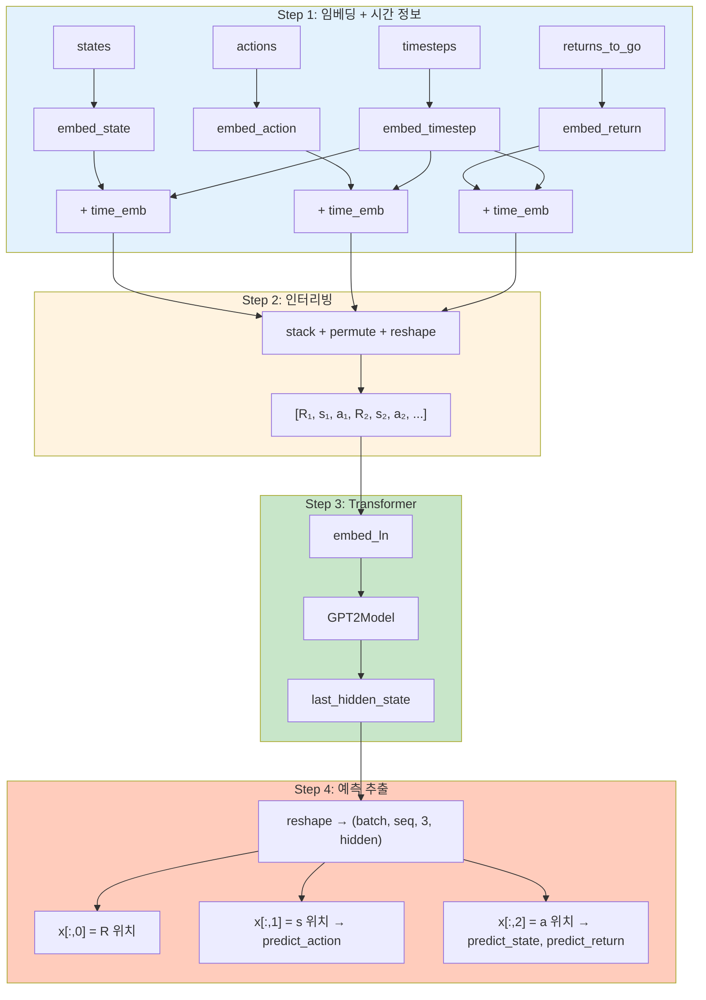
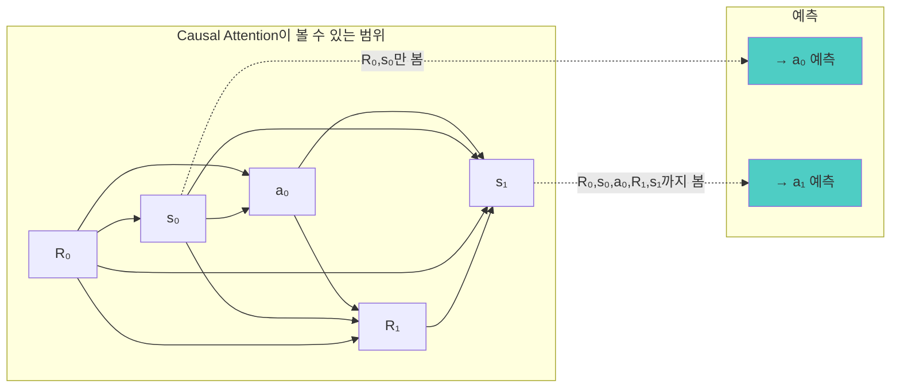
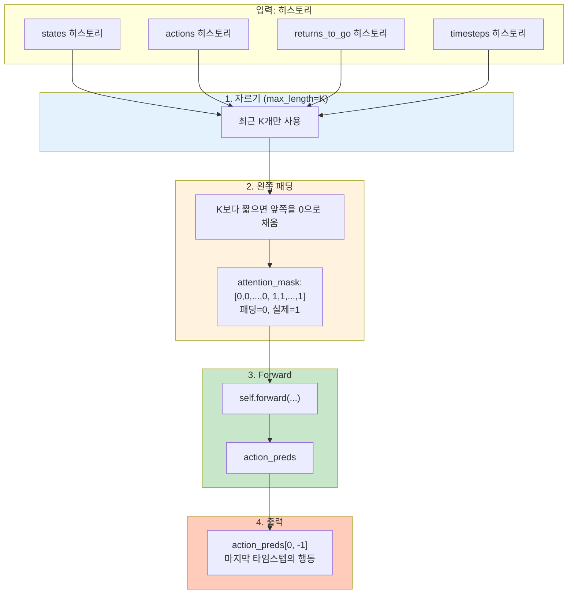

# Decision Transformer (Gym) 코드 분석

이 문서는 `gym/decision_transformer/models/decision_transformer.py`의 구현을 단계별로 분석합니다.

## 목차

1. [전체 구조 개요](#1-전체-구조-개요)
2. [`__init__` — 모델 구조 정의](#2-__init__--모델-구조-정의)
3. [`forward` — 순전파](#3-forward--순전파)
4. [`get_action` — 추론](#4-get_action--추론)
5. [Atari 버전과의 차이점](#5-atari-버전과의-차이점)

---

## 1. 전체 구조 개요



**파일:** `gym/decision_transformer/models/decision_transformer.py`

`DecisionTransformer`는 `TrajectoryModel`을 상속하며, HuggingFace GPT-2를 backbone으로 사용합니다. 단, 원본 GPT-2와 다르게 **위치 임베딩이 제거**되어 있고, 대신 `embed_timestep`으로 시간 정보를 직접 주입합니다.

---

## 2. `__init__` — 모델 구조 정의

**위치:** 17-52행

### 2.1 GPT-2 설정

```python
config = transformers.GPT2Config(
    vocab_size=1,  # 토큰 임베딩을 사용하지 않으므로 무관
    n_embd=hidden_size,
    **kwargs
)
self.transformer = GPT2Model(config)
```

`vocab_size=1`인 이유: NLP처럼 단어 인덱스를 넣는 게 아니라, 직접 만든 임베딩(`inputs_embeds`)을 GPT-2에 넣기 때문입니다.

### 2.2 임베딩 레이어

| 레이어 | 입력 → 출력 | 역할 |
|--------|------------|------|
| `embed_state` | state_dim → hidden_size | 상태 벡터를 임베딩 |
| `embed_action` | act_dim → hidden_size | 행동 벡터를 임베딩 |
| `embed_return` | 1 → hidden_size | RTG 스칼라를 임베딩 |
| `embed_timestep` | 정수 → hidden_size | 타임스텝 위치 임베딩 (`nn.Embedding`) |
| `embed_ln` | LayerNorm(hidden_size) | 최종 임베딩 정규화 |

### 2.3 예측 헤드

| 레이어 | 입력 → 출력 | 역할 |
|--------|------------|------|
| `predict_action` | hidden_size → act_dim (+Tanh) | **행동 예측** (실제 사용) |
| `predict_state` | hidden_size → state_dim | 다음 상태 예측 (논문에서 미사용) |
| `predict_return` | hidden_size → 1 | 다음 return 예측 (논문에서 미사용) |

`action_tanh=True`이면 출력에 `Tanh()`가 붙어 행동 값이 [-1, 1] 범위로 제한됩니다 (연속 행동 공간에 적합).

---

## 3. `forward` — 순전파

**위치:** 54-101행



### Step 1: 임베딩 + 시간 정보 추가 (63-71행)

```python
state_embeddings = self.embed_state(states) + time_embeddings
action_embeddings = self.embed_action(actions) + time_embeddings
returns_embeddings = self.embed_return(returns_to_go) + time_embeddings
```

세 모달리티(R, s, a) 모두 동일한 타임스텝 임베딩을 더합니다. 이것이 GPT-2에서 제거된 위치 임베딩을 대체합니다.

### Step 2: 인터리빙 (75-78행) — 핵심 트릭

```python
stacked_inputs = torch.stack(
    (returns_embeddings, state_embeddings, action_embeddings), dim=1
).permute(0, 2, 1, 3).reshape(batch_size, 3*seq_length, self.hidden_size)
```

시퀀스 길이 K=3일 때 변환 과정:

```
stack   → (batch, 3, K, hidden)     # [R, s, a] 3개를 모달리티 축으로 쌓음
permute → (batch, K, 3, hidden)     # 타임스텝별로 재배치
reshape → (batch, 3K, hidden)       # 하나의 시퀀스로 펼침

결과: [R₁, s₁, a₁, R₂, s₂, a₂, R₃, s₃, a₃]
```

이렇게 하면 GPT의 causal attention에서 **s₁이 R₁까지만 보고 a₁을 예측**하는 autoregressive 구조가 자연스럽게 만들어집니다.

### Step 3: Transformer 통과 (86-90행)

```python
transformer_outputs = self.transformer(
    inputs_embeds=stacked_inputs,
    attention_mask=stacked_attention_mask,
)
x = transformer_outputs['last_hidden_state']
```

`attention_mask`도 동일하게 3배로 확장합니다.

### Step 4: 예측 추출 (94-99행)

```python
x = x.reshape(batch_size, seq_length, 3, self.hidden_size).permute(0, 2, 1, 3)

action_preds = self.predict_action(x[:,1])  # s 위치 → action 예측
state_preds  = self.predict_state(x[:,2])   # a 위치 → next state 예측
return_preds = self.predict_return(x[:,2])  # a 위치 → next return 예측
```

**왜 `x[:,1]` (s 위치)로 action을 예측하는가?**



Causal mask 때문에 position 1(=s)의 출력은 R과 s까지만 볼 수 있고 a는 볼 수 없습니다. 따라서 "R과 s가 주어졌을 때 a를 예측"하는 올바른 조건부 분포 P(a|R,s)가 됩니다.

---

## 4. `get_action` — 추론

**위치:** 103-140행

평가(evaluation) 시 환경과 상호작용하며 한 스텝씩 행동을 뽑는 함수입니다.



### 패딩이 왼쪽에 붙는 이유

```
max_length = 5, 현재 히스토리 = 3일 때:

패딩 후:  [0, 0, s₁, s₂, s₃]
mask:     [0, 0,  1,  1,  1]
```

**가장 최근 타임스텝이 항상 시퀀스 끝에** 위치하도록 보장합니다. 이렇게 해야 causal attention에서 최근 정보를 자연스럽게 활용하고, `action_preds[0,-1]`로 간단히 마지막 행동을 추출할 수 있습니다.

---

## 5. Atari 버전과의 차이점

| 항목 | Gym (`decision_transformer.py`) | Atari (`model_atari.py`) |
|------|------|------|
| **Backbone** | HuggingFace GPT-2 (커스텀) | minGPT (자체 구현) |
| **State 인코더** | `nn.Linear` | CNN (Conv2d 3층) |
| **Action 공간** | 연속 (회귀, MSE loss) | 이산 (분류, Cross-Entropy) |
| **Action 활성화** | `Tanh` ([-1,1] 범위) | 없음 (logits → softmax) |
| **위치 임베딩** | `embed_timestep` (GPT-2 pos emb 제거) | global + relative pos emb |
| **정규화** | `embed_ln` (LayerNorm) | Dropout |
| **Config** | `transformers.GPT2Config` | 자체 `GPTConfig` |
| **기본 설정** | 3 layers, 1 head | 6 layers, 8 heads |

---

**관련 문서:**
- [Atari 코드 분석](./code-walkthrough.md) — Atari 버전의 상세 코드 분석
- [아키텍처 흐름](./architecture-flow.md) — 전체 시스템 다이어그램
- [시스템 분석](./system-analysis.md) — Atari vs Gym 비교
