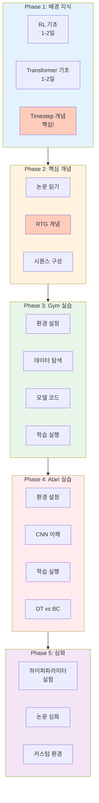
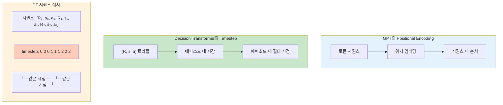
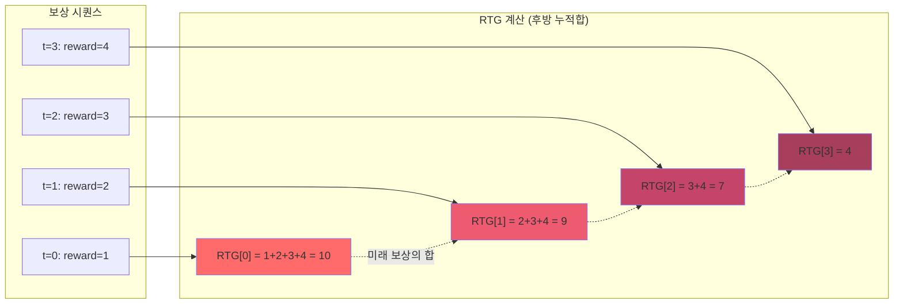
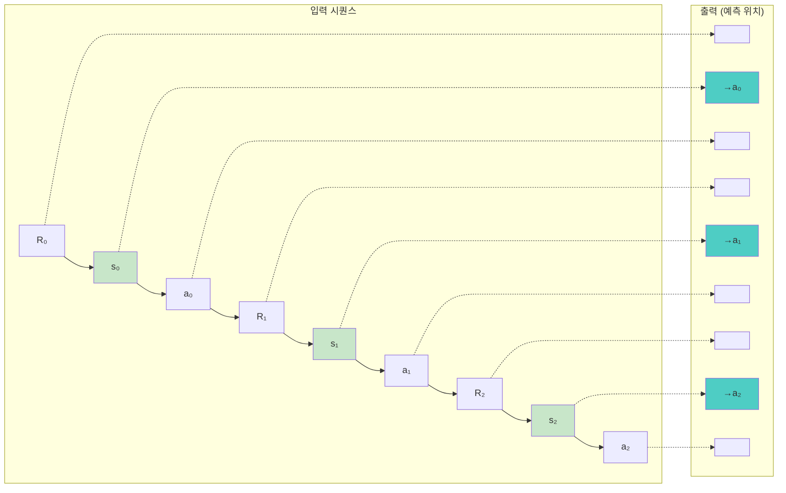
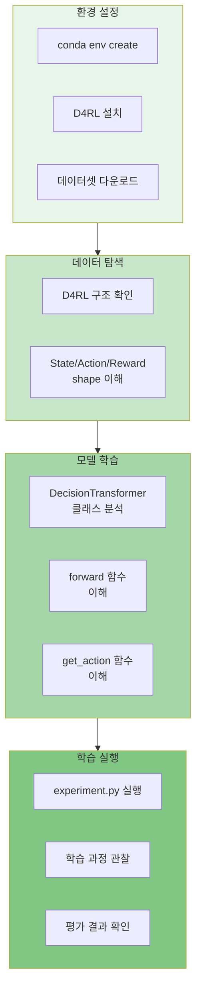
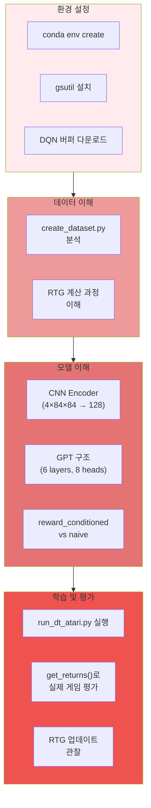
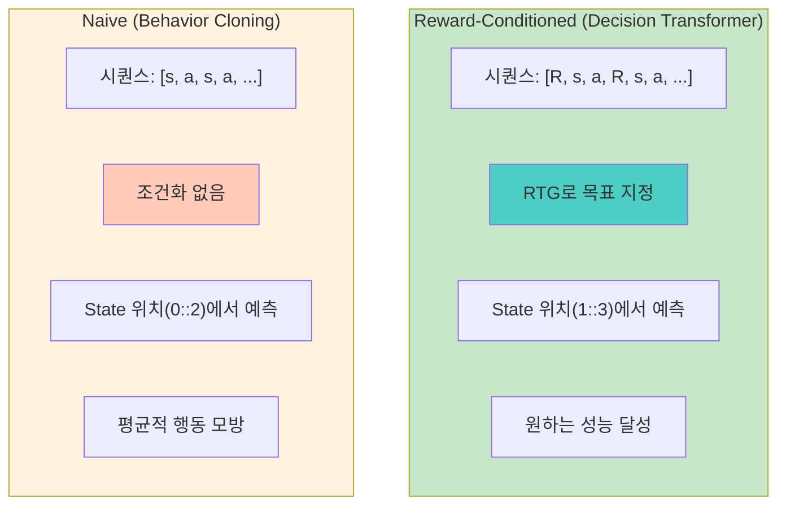

# Decision Transformer 초보자 학습 계획

이 문서는 Decision Transformer를 처음 접하는 분들을 위한 **단계별 학습 계획**입니다.
각 단계마다 이해해야 할 개념, 읽어야 할 코드, 직접 해볼 실습이 포함되어 있습니다.

---

## 학습 로드맵 개요



---

## Phase 1: 배경 지식

### 1.1 강화학습 기초

**목표**: RL의 기본 용어와 개념 이해

**학습할 개념**:
- [ ] State, Action, Reward의 정의
- [ ] Episode와 Trajectory
- [ ] Policy (정책): π(a|s)
- [ ] Return: 누적 보상의 합
- [ ] Discount factor (γ)

**추천 자료**:
- Sutton & Barto "Reinforcement Learning" 1-3장
- OpenAI Spinning Up: https://spinningup.openai.com/

**실습 체크포인트**:
```python
# 이 개념들을 설명할 수 있는가?
# 1. "Return이 뭔가요?" → 에피소드 끝까지의 보상 합
# 2. "Policy가 뭔가요?" → 상태에서 행동을 선택하는 규칙
# 3. "Discount factor는 왜 필요한가요?" → 미래 보상의 가치를 현재보다 낮게 평가
```

### 1.2 Transformer 기초

**목표**: Transformer 아키텍처의 핵심 이해

**학습할 개념**:
- [ ] Self-Attention 메커니즘
- [ ] Multi-Head Attention
- [ ] Positional Encoding
- [ ] Causal Masking (왜 미래를 볼 수 없는가?)
- [ ] GPT의 Autoregressive 생성

**추천 자료**:
- "Attention Is All You Need" 논문
- Jay Alammar's Illustrated Transformer: https://jalammar.github.io/illustrated-transformer/

**실습 체크포인트**:
```python
# 이 질문들에 답할 수 있는가?
# 1. "Causal masking이 뭔가요?" → 미래 토큰을 보지 못하게 하는 마스크
# 2. "왜 position embedding이 필요한가요?" → Transformer는 순서 정보가 없어서
# 3. "GPT는 어떻게 다음 토큰을 예측하나요?" → 이전 토큰들만 보고 다음을 예측
```

### 1.3 Timestep의 의미 (중요!)



Decision Transformer에서 **timestep**은 두 가지 맥락에서 사용됩니다:

#### Positional Encoding에서의 timestep

일반적인 Transformer에서 timestep은 **시퀀스 내 위치(position)**를 의미합니다:
```
시퀀스: [토큰0, 토큰1, 토큰2, 토큰3]
위치:      0      1      2      3
```

#### Decision Transformer에서의 timestep (핵심!)

DT에서 timestep은 **에피소드 내 시간 단계**를 의미합니다:
- **t=0**: 에피소드 시작 시점
- **t=1**: 첫 번째 행동 후
- **t=2**: 두 번째 행동 후
- ...

**GPT vs Decision Transformer 비교**:

| GPT | Decision Transformer |
|:---:|:---:|
| 시퀀스 내 위치 (0, 1, 2...) | 에피소드 내 시간 단계 |
| "The=0, cat=1, sat=2" | "t=0에서의 (R, s, a)" |

**핵심 차이점**: DT에서는 같은 timestep에 **(R, s, a)** 세 개의 토큰이 모두 **같은 timestep 임베딩**을 공유합니다.

```
시퀀스:    [R₀,  s₀,  a₀,  R₁,  s₁,  a₁,  R₂,  s₂,  a₂]
timestep:   0    0    0    1    1    1    2    2    2
           └─ 같은 시점 ─┘  └─ 같은 시점 ─┘  └─ 같은 시점 ─┘
```

이를 통해 모델이 "이 상태와 행동이 같은 시점에 일어났다"는 것을 이해할 수 있습니다.

**코드에서 확인**:
```python
# gym/decision_transformer/models/decision_transformer.py
time_embeddings = self.embed_timestep(timesteps)

# 같은 timestep 임베딩이 R, s, a 모두에 더해짐
state_embeddings = state_embeddings + time_embeddings
action_embeddings = action_embeddings + time_embeddings
returns_embeddings = returns_embeddings + time_embeddings
```

---

## Phase 2: Decision Transformer 핵심 개념

### 2.1 논문 읽기

**목표**: Decision Transformer의 핵심 아이디어 파악

**읽을 자료**:
- [ ] [Decision Transformer 논문](https://arxiv.org/abs/2106.01345) - Abstract, Introduction, Method 섹션

**핵심 질문**:
1. 기존 RL과 DT의 차이점은?
2. Return-to-Go (RTG)란 무엇인가?
3. 왜 "시퀀스 모델링"으로 RL을 풀 수 있는가?

### 2.2 Return-to-Go 개념 깊이 이해

**목표**: RTG의 계산 방식과 역할 이해

**읽을 문서**: [architecture-flow.md](./architecture-flow.md) - "RTG 계산 세부 과정" 섹션



**핵심 개념**:
```
시점:     t=0    t=1    t=2    t=3
보상:      1      2      3      4
----------------------------------
RTG[0] = 1+2+3+4 = 10  (처음부터 끝까지)
RTG[1] = 2+3+4 = 9     (t=1부터 끝까지)
RTG[2] = 3+4 = 7       (t=2부터 끝까지)
RTG[3] = 4             (마지막)
```

**실습: RTG 직접 계산해보기**
```python
# 터미널에서 Python 실행
python3

rewards = [1, 2, 3, 4, 5]

# RTG 계산 (직접 구현)
rtg = []
for i in range(len(rewards)):
    rtg.append(sum(rewards[i:]))

print("Rewards:", rewards)
print("RTG:", rtg)
# 예상 출력: RTG: [15, 14, 12, 9, 5]
```

### 2.3 시퀀스 구성 이해

**목표**: (R, s, a) 트리플의 시퀀스 구성 방식 이해



**핵심 개념**:
```
Decision Transformer 입력:
[R₀, s₀, a₀, R₁, s₁, a₁, R₂, s₂, a₂, ...]
 └─ 트리플 1 ─┘  └─ 트리플 2 ─┘  └─ 트리플 3 ─┘

예측 위치:
[  , →a₀,   ,   , →a₁,   ,   , →a₂,   ]
    (s₀에서)      (s₁에서)      (s₂에서)
```

**실습: 시퀀스 구성 시각화**
```python
# 시퀀스가 어떻게 구성되는지 직접 확인
rtgs = ["R0=10", "R1=9", "R2=7"]
states = ["s0", "s1", "s2"]
actions = ["a0", "a1", "a2"]

sequence = []
for r, s, a in zip(rtgs, states, actions):
    sequence.extend([r, s, a])

print("시퀀스:", sequence)
# 출력: ['R0=10', 's0', 'a0', 'R1=9', 's1', 'a1', 'R2=7', 's2', 'a2']

# 예측 위치 (state 위치에서 action 예측)
print("예측 위치 (1::3):", sequence[1::3])
# 출력: ['s0', 's1', 's2'] - 이 위치에서 a0, a1, a2 예측
```

---

## Phase 3: Gym 환경 실습



Gym 환경이 더 단순하므로 먼저 학습합니다.

### 3.1 환경 설정

```bash
# 1. Conda 환경 생성
cd gym
conda env create -f conda_env.yml
conda activate decision-transformer-gym

# 2. D4RL 설치 (데이터셋용)
pip install git+https://github.com/Farama-Foundation/d4rl@master#egg=d4rl

# 3. 데이터셋 다운로드
python data/download_d4rl_datasets.py
```

### 3.2 데이터 구조 탐색

**목표**: D4RL 데이터셋의 구조 이해

**실습: 데이터셋 직접 열어보기**
```python
# gym/ 디렉토리에서 실행
cd gym
python3

import pickle

# 데이터셋 로드
with open('data/hopper-medium-v2.pkl', 'rb') as f:
    trajectories = pickle.load(f)

# 데이터 구조 확인
print(f"궤적 수: {len(trajectories)}")
print(f"첫 번째 궤적 키: {trajectories[0].keys()}")

traj = trajectories[0]
print(f"State shape: {traj['observations'].shape}")
print(f"Action shape: {traj['actions'].shape}")
print(f"Reward shape: {traj['rewards'].shape}")

# 몇 개의 값 출력
print(f"\n첫 3개 state:\n{traj['observations'][:3]}")
print(f"\n첫 3개 action:\n{traj['actions'][:3]}")
print(f"\n첫 3개 reward: {traj['rewards'][:3]}")
```

### 3.3 모델 코드 읽기

**목표**: DecisionTransformer 클래스 이해

**읽을 파일**: `gym/decision_transformer/models/decision_transformer.py`

**단계별 코드 읽기**:

1. **클래스 구조 파악** (lines 10-50)
```python
# 어떤 레이어들이 있는지 확인
# - embed_timestep: 시간 임베딩
# - embed_return: RTG 임베딩
# - embed_state: 상태 임베딩
# - embed_action: 행동 임베딩
# - transformer: GPT2 모델
# - predict_action: 행동 예측 헤드
```

2. **forward 함수 분석** (lines 52-99)
```python
# 입력이 어떻게 처리되는지 추적
# 1. 각 입력(state, action, return) 임베딩
# 2. timestep 임베딩 추가
# 3. 시퀀스 인터리빙 (stacked_inputs)
# 4. Transformer 통과
# 5. action 예측 추출
```

3. **get_action 함수 분석** (lines 103-140)
```python
# 추론 시 어떻게 action을 얻는지 확인
# - 히스토리 자르기 (max_length)
# - 패딩 처리
# - forward 호출
# - 마지막 action 반환
```

**실습: 모델 구조 출력하기**
```python
cd gym
python3

import torch
from decision_transformer.models.decision_transformer import DecisionTransformer

# 모델 생성
model = DecisionTransformer(
    state_dim=11,      # hopper의 state 차원
    act_dim=3,         # hopper의 action 차원
    max_length=20,     # context length (K)
    max_ep_len=1000,   # 최대 에피소드 길이
    hidden_size=128,
    n_layer=3,
    n_head=1,
    n_inner=128*4,
    activation_function='relu',
    n_positions=1024,
    resid_pdrop=0.1,
    attn_pdrop=0.1,
)

print(model)

# 파라미터 수 계산
total_params = sum(p.numel() for p in model.parameters())
print(f"\n총 파라미터 수: {total_params:,}")
```

### 3.4 학습 실행

**목표**: 실제 학습을 돌려보고 결과 확인

```bash
cd gym

# 짧은 학습 실행 (테스트용)
python experiment.py \
    --env hopper \
    --dataset medium \
    --model_type dt \
    --max_iters 5 \
    --num_steps_per_iter 100

# 예상 출력:
# iteration 1, eval return 1234.56 (target 1800), ...
```

**실습: 학습 과정 이해하기**
```python
# experiment.py 주요 부분 분석
# 1. get_batch() 함수 (line 118-164): 배치 생성
# 2. model.forward() 호출
# 3. MSE 손실 계산
# 4. 평가 (evaluate_episode_rtg)
```

### 3.5 평가 과정 이해

**목표**: RTG 조건부 추론 이해

**읽을 파일**: `gym/decision_transformer/evaluation/evaluate_episodes.py`

**핵심 코드 분석**:
```python
# evaluate_episode_rtg 함수에서:
# 1. 초기 target_return 설정
# 2. 매 스텝마다:
#    - model.get_action() 호출
#    - 환경에서 action 실행
#    - target_return -= reward/scale  # RTG 업데이트!
```

**실습: RTG 업데이트 시뮬레이션**
```python
# 추론 시 RTG가 어떻게 변하는지 시뮬레이션
target_return = 1800  # 목표
scale = 1000
rewards = [50, 100, 75, 200, 150]  # 가상의 보상들

print(f"초기 RTG: {target_return}")
for i, reward in enumerate(rewards):
    target_return -= reward / scale
    print(f"Step {i+1}: reward={reward}, 새 RTG={target_return:.2f}")
```

---

## Phase 4: Atari 환경 실습



### 4.1 환경 설정

```bash
# 1. Conda 환경 생성
cd atari
conda env create -f conda_env.yml
conda activate decision-transformer-atari

# 2. 데이터셋 다운로드 (용량이 큼, 하나의 게임만 먼저)
mkdir -p dqn_replay
gsutil -m cp -R gs://atari-replay-datasets/dqn/Breakout dqn_replay/

# gsutil이 없다면 Google Cloud SDK 설치 필요
```

### 4.2 데이터셋 생성 과정 이해

**목표**: DQN replay buffer → RTG 데이터셋 변환 이해

**읽을 파일**: `atari/create_dataset.py`

**핵심 코드**:
```python
# RTG 계산 부분 (lines 81-90)
for j in range(i-1, start_index-1, -1):  # 역순 순회!
    rtg_j = curr_traj_returns[j-start_index:i-start_index]
    rtg[j] = sum(rtg_j)
```

**실습: 데이터셋 생성 테스트**
```python
cd atari
python3

from create_dataset import create_dataset

# 소량의 데이터만 로드 (테스트용)
obss, actions, returns, done_idxs, rtgs, timesteps = create_dataset(
    num_buffers=5,        # 5개 버퍼만
    num_steps=1000,       # 1000 스텝만
    game='Breakout',
    data_dir_prefix='./dqn_replay/',
    trajectories_per_buffer=2
)

print(f"관측 수: {len(obss)}")
print(f"관측 shape: {obss[0].shape}")  # (4, 84, 84)
print(f"행동 수: {len(actions)}")
print(f"RTG 범위: {min(rtgs)} ~ {max(rtgs)}")
print(f"에피소드 수: {len(done_idxs)}")
```

### 4.3 모델 구조 이해

**목표**: Atari용 GPT 모델의 CNN encoder 이해

**읽을 파일**: `atari/mingpt/model_atari.py`

**핵심 구조**:
```python
# State encoder (CNN) - lines 149-152
# 4×84×84 이미지 → 128 차원 벡터

# Conv2d(4, 32, 8, stride=4)  → 32×20×20
# Conv2d(32, 64, 4, stride=2) → 64×9×9
# Conv2d(64, 64, 3, stride=1) → 64×7×7
# Flatten → 3136
# Linear(3136, 128) → 128
```

**실습: CNN encoder 이해하기**
```python
cd atari
python3

import torch
import torch.nn as nn

# Atari CNN encoder 구현
encoder = nn.Sequential(
    nn.Conv2d(4, 32, 8, stride=4, padding=0), nn.ReLU(),
    nn.Conv2d(32, 64, 4, stride=2, padding=0), nn.ReLU(),
    nn.Conv2d(64, 64, 3, stride=1, padding=0), nn.ReLU(),
    nn.Flatten(),
    nn.Linear(3136, 128),
    nn.Tanh()
)

# 입력 테스트
x = torch.randn(1, 4, 84, 84)  # 배치 1, 4프레임, 84x84
out = encoder(x)
print(f"입력 shape: {x.shape}")
print(f"출력 shape: {out.shape}")  # (1, 128)
```

### 4.4 학습 실행

```bash
cd atari

# 짧은 학습 (GPU 권장)
python run_dt_atari.py \
    --seed 123 \
    --context_length 30 \
    --epochs 1 \
    --model_type 'reward_conditioned' \
    --num_steps 10000 \
    --num_buffers 5 \
    --game 'Breakout' \
    --batch_size 64 \
    --data_dir_prefix ./dqn_replay
```

### 4.5 Reward-Conditioned vs Naive 비교

**목표**: 두 모드의 차이 이해



| 항목 | Reward-Conditioned | Naive |
|-----|-------------------|-------|
| 시퀀스 | [R, s, a, R, s, a, ...] | [s, a, s, a, ...] |
| 조건화 | RTG로 목표 지정 | 없음 |
| 추론 시 | 원하는 RTG 설정 가능 | 평균적 행동 |
| 예측 위치 | 1::3 (state 위치) | 0::2 (state 위치) |

**실습: 두 모드 비교 실행**
```bash
# Reward-conditioned (DT)
python run_dt_atari.py --model_type reward_conditioned --epochs 1 --num_steps 5000

# Naive (BC)
python run_dt_atari.py --model_type naive --epochs 1 --num_steps 5000
```

---

## Phase 5: 심화 학습 (선택)

### 5.1 코드 수정 실습

**아이디어 1**: Context length 변경 효과 실험
```bash
# K=10 vs K=30 vs K=50 비교
python run_dt_atari.py --context_length 10 ...
python run_dt_atari.py --context_length 30 ...
python run_dt_atari.py --context_length 50 ...
```

**아이디어 2**: 다른 게임 실험
```bash
# Pong 데이터셋 다운로드 후
gsutil -m cp -R gs://atari-replay-datasets/dqn/Pong dqn_replay/
python run_dt_atari.py --game Pong ...
```

### 5.2 논문 심화 읽기

- [ ] Experiments 섹션 전체 읽기
- [ ] Ablation studies 분석
- [ ] 관련 논문: Trajectory Transformer, Online Decision Transformer

### 5.3 커스텀 환경 적용

간단한 환경에 Decision Transformer 적용해보기:
1. CartPole 환경
2. 자체 데이터셋 생성
3. 학습 및 평가

---

## 체크리스트

### Phase 1 완료 체크
- [ ] RL 기본 용어 설명 가능
- [ ] Transformer attention 이해
- [ ] Causal masking 설명 가능

### Phase 2 완료 체크
- [ ] RTG 손으로 계산 가능
- [ ] DT의 시퀀스 구성 설명 가능
- [ ] 논문 핵심 아이디어 요약 가능

### Phase 3 완료 체크
- [ ] Gym 환경 설정 완료
- [ ] 데이터셋 구조 이해
- [ ] 학습 1회 이상 실행
- [ ] get_action 함수 이해

### Phase 4 완료 체크
- [ ] Atari 환경 설정 완료
- [ ] CNN encoder 이해
- [ ] reward_conditioned vs naive 차이 설명 가능
- [ ] 학습 1회 이상 실행

### Phase 5 완료 체크
- [ ] 하이퍼파라미터 실험 수행
- [ ] 다른 게임/환경 시도
- [ ] 코드 수정 경험

---

## 문제 해결 가이드

### 자주 발생하는 오류

**1. MuJoCo 라이선스 오류**
```bash
# MuJoCo 2.1+ 는 무료
pip install mujoco
```

**2. gsutil 없음**
```bash
# Google Cloud SDK 설치
curl https://sdk.cloud.google.com | bash
gcloud init
```

**3. CUDA 메모리 부족**
```bash
# 배치 사이즈 줄이기
--batch_size 32
```

**4. D4RL 설치 오류**
```bash
pip install git+https://github.com/Farama-Foundation/d4rl@master#egg=d4rl
```

---

## 다음 단계

이 학습 계획을 완료한 후:

1. **Online Decision Transformer** 논문 읽기
2. **Trajectory Transformer** 비교 분석
3. **실제 로봇 환경** 적용 시도
4. **커스텀 보상 함수** 실험

---

## 관련 문서

- [architecture-flow.md](./architecture-flow.md): Atari 아키텍처 다이어그램
- [code-walkthrough.md](./code-walkthrough.md): 코드 상세 분석
- [system-analysis.md](./system-analysis.md): 전체 시스템 분석
