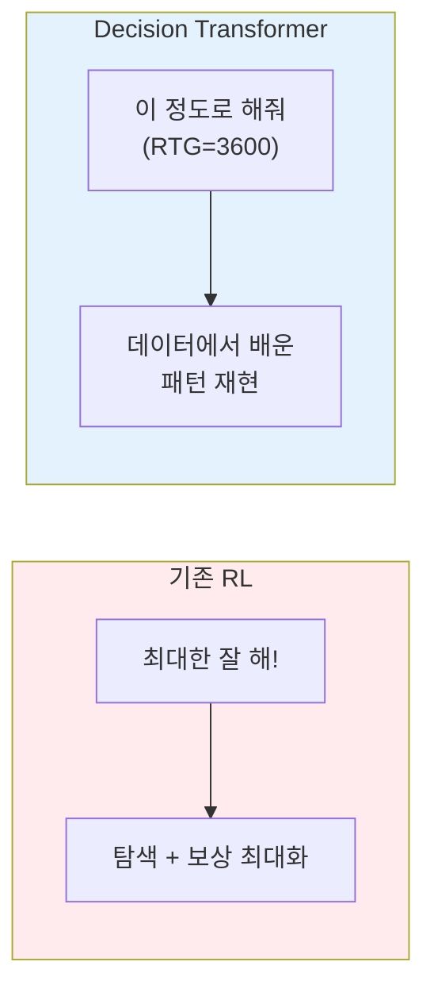
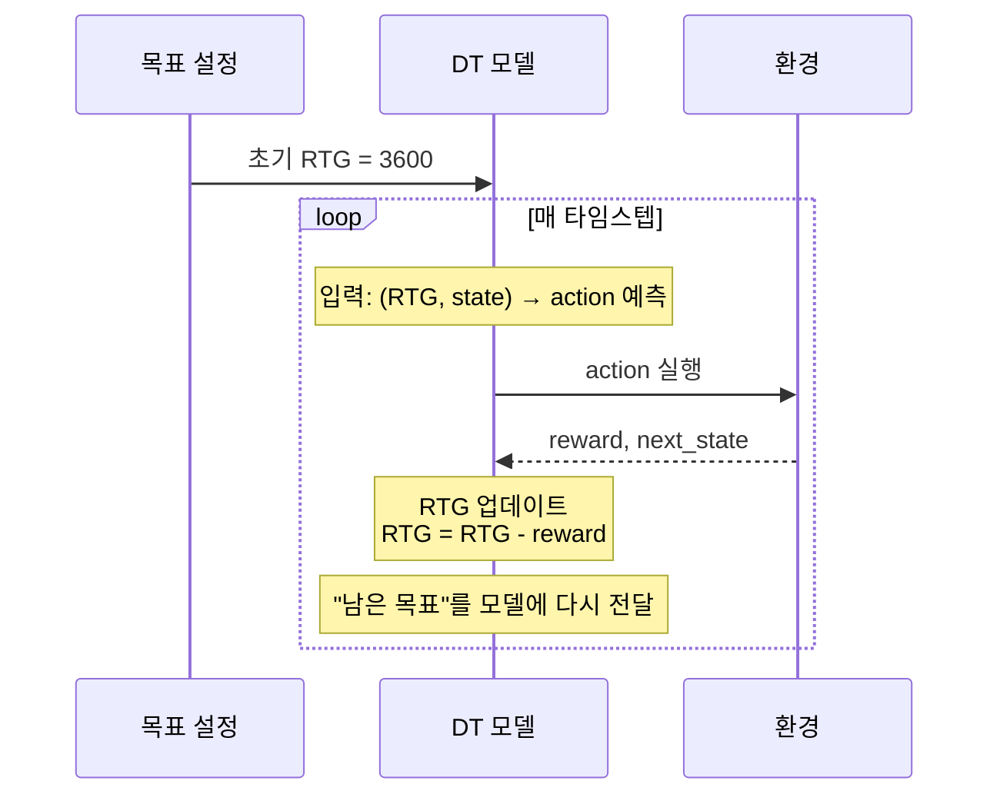
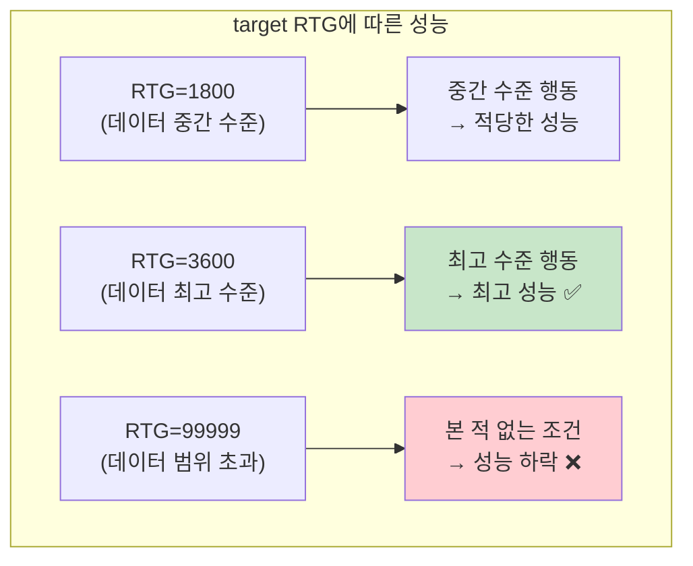

# RTG (Return-to-Go) 심층 이해

## RTG란?

**현재 시점부터 에피소드 끝까지 받을 수 있는 총 보상**

$$RTG_t = r_t + r_{t+1} + r_{t+2} + \cdots + r_T$$

```
rewards = [10, 15, 20, 5]

RTG[0] = 10 + 15 + 20 + 5 = 50   "앞으로 50 받을 수 있어"
RTG[1] =      15 + 20 + 5 = 40   "앞으로 40 받을 수 있어"
RTG[2] =           20 + 5 = 25   "앞으로 25 받을 수 있어"
RTG[3] =                5 = 5    "앞으로 5 받을 수 있어"
```

---

## DT에서 RTG의 역할: "조건" 이지 "최적화 목표"가 아니다



| | 기존 RL | Decision Transformer |
|---|---|---|
| 목표 | 보상 **최대화** | 주어진 RTG에 **맞는** 행동 생성 |
| 방식 | 탐색 (exploration) | 조건부 생성 (conditional generation) |
| 상한선 | 이론적으로 무한 | **학습 데이터의 최고 성능** |

---

## 추론 시 RTG 업데이트 메커니즘

추론 시 RTG는 고정값이 아니라 **매 스텝 실시간 업데이트**된다.



### 구체적 예시

```
t=0:  RTG=3600  →  모델: action₀  →  reward=10
t=1:  RTG=3590  →  모델: action₁  →  reward=20
t=2:  RTG=3570  →  모델: action₂  →  reward=15
t=3:  RTG=3555  →  모델: action₃  →  ...
...
t=999: RTG≈0    →  에피소드 종료
```

**핵심**: 모델에게 매 스텝 "너는 지금 3600점짜리 플레이 중이야, 아직 이만큼 남았어"라는 문맥을 실시간으로 알려준다.

---

## target RTG를 높게 주면 어떻게 되나?



| target RTG | 결과 |
|---|---|
| 데이터 범위 내 낮은 값 (예: 1800) | 중간 수준의 행동 생성 |
| 데이터 최고 성능 근처 (예: 3600) | **가장 좋은 성능** |
| 데이터를 훨씬 초과 (예: 99999) | 학습에서 본 적 없는 조건 → **성능 하락** |

> **데이터 품질이 성능의 상한선이다.**
> DT는 데이터에 있는 최고 성능을 넘어설 수 없다.

---

## 실제 코드에서의 RTG 설정

### 환경별 target RTG (`experiment.py`)

```python
# 평가 시 사용하는 target RTG 값들
if env_name == 'hopper':
    env_targets = [3600, 1800]   # 높은 목표, 낮은 목표
elif env_name == 'halfcheetah':
    env_targets = [12000, 6000]
elif env_name == 'walker2d':
    env_targets = [5000, 2500]
```

두 가지 값을 테스트하는 이유: 높은/낮은 RTG에서 모델이 실제로 다른 수준의 행동을 하는지 확인하기 위함.

### 추론 시 RTG 업데이트 (`evaluate_episode_rtg()`)

```python
# 에피소드 시작
target_return = 3600 / scale  # 초기 RTG 설정

for t in range(max_ep_len):
    # 모델이 action 예측
    action = model.get_action(states, actions, target_return, ...)

    # 환경에서 실행
    state, reward, done, _ = env.step(action)

    # RTG 업데이트 (핵심!)
    pred_return = target_return[0, -1] - (reward / scale)
    target_return = torch.cat([target_return, pred_return.reshape(1, 1)], dim=1)
```

---

## RTG 스케일링

RTG 원본 값은 수백~수천 범위라서, 모델 입력으로 바로 넣으면 학습이 불안정하다.

```
RTG 원본:  3600, 3590, 3570, ...
RTG / 1000:  3.6,  3.59,  3.57, ...  ← 모델에 입력되는 값
```

| 환경 | scale | 이유 |
|---|---|---|
| Hopper, HalfCheetah, Walker2d | 1000 | return이 수천 단위 |
| Reacher2d | 10 | return이 수십 단위 |

---

## 핵심 요약

1. **RTG는 조건이다** - "이 정도 성과를 내는 행동을 해줘"
2. **매 스텝 업데이트** - 받은 보상만큼 차감하여 "남은 목표"를 실시간 전달
3. **데이터가 상한선** - 데이터 최고 성능 이상의 RTG를 줘도 성능이 올라가지 않음
4. **실전에서는 최고값 사용** - 데이터에서 본 최고 성능 수준의 RTG를 초기값으로 설정
