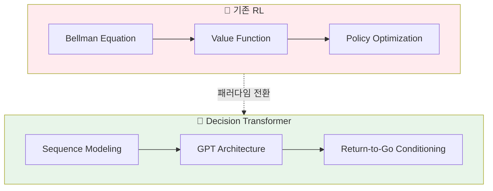
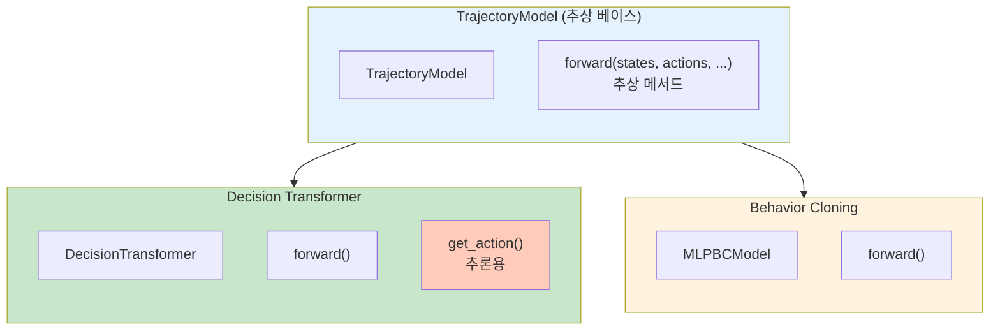
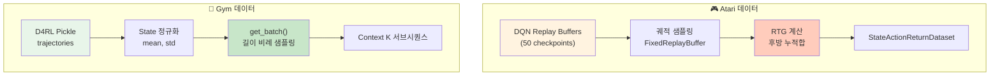
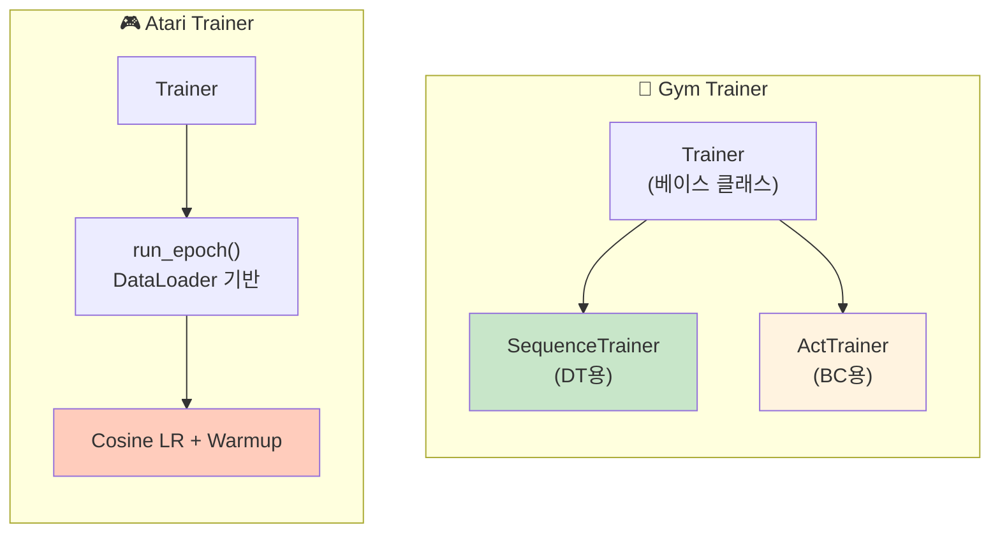
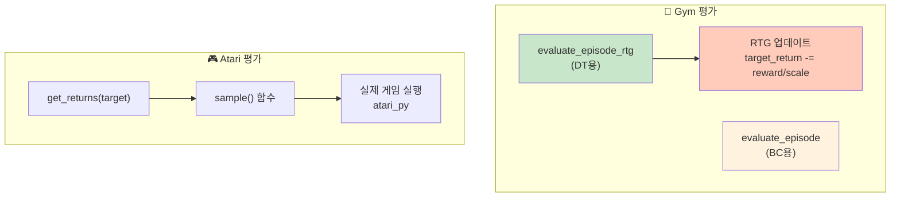

# Decision Transformer 전체 시스템 분석

이 문서는 Decision Transformer의 전체 시스템(Atari + Gym 환경)을 분석한 종합 문서입니다.

## 목차

1. [개요](#1-개요)
2. [핵심 모델 컴포넌트](#2-핵심-모델-컴포넌트)
3. [데이터 처리 파이프라인](#3-데이터-처리-파이프라인)
4. [학습 시스템](#4-학습-시스템)
5. [평가 시스템](#5-평가-시스템)
6. [전체 실행 흐름](#6-전체-실행-흐름)
7. [주요 하이퍼파라미터](#7-주요-하이퍼파라미터)
8. [핵심 설계 결정](#8-핵심-설계-결정)
9. [파일 구조 요약](#9-파일-구조-요약)

---

## 1. 개요



Decision Transformer는 강화학습(RL)을 **시퀀스 모델링 문제**로 재구성한 연구입니다. 기존 RL의 벨만 방정식(Bellman equation) 기반 접근법 대신, GPT 아키텍처를 사용하여 (Return-to-go, State, Action) 시퀀스를 autoregressive하게 모델링합니다.

**핵심 아이디어**: 원하는 return(목표 보상)을 조건으로 주면, 해당 return을 달성할 수 있는 action을 예측

---

## 1. 개요

Decision Transformer는 강화학습(RL)을 **시퀀스 모델링 문제**로 재구성한 연구입니다. 기존 RL의 벨만 방정식(Bellman equation) 기반 접근법 대신, GPT 아키텍처를 사용하여 (Return-to-go, State, Action) 시퀀스를 autoregressive하게 모델링합니다.

**핵심 아이디어**: 원하는 return(목표 보상)을 조건으로 주면, 해당 return을 달성할 수 있는 action을 예측

---

## 2. 핵심 모델 컴포넌트



### 2.1 Gym 환경: DecisionTransformer

**파일**: [decision_transformer.py](../gym/decision_transformer/models/decision_transformer.py)

```
입력: (states, actions, rewards, returns_to_go, timesteps)
                    ↓
        ┌──────────┼──────────┐
        ↓          ↓          ↓
   embed_state  embed_action  embed_return
   (Linear)     (Linear)      (Linear)
        ↓          ↓          ↓
        └──── + time_embeddings ────┘
                    ↓
         Interleave: [R₁, s₁, a₁, R₂, s₂, a₂, ...]
                    ↓
              LayerNorm + Dropout
                    ↓
           GPT2Model (Transformer)
                    ↓
         ┌──────────┼──────────┐
         ↓          ↓          ↓
   predict_state  predict_action  predict_return
                    ↓
              action_preds (Tanh)
```

**주요 특징**:
- **Timestep Embedding**: 위치 임베딩 대신 timestep을 직접 임베딩 (line 40)
- **Sequence Interleaving**: (R, s, a) 트리플을 인터리빙하여 3×seq_len 길이의 시퀀스 생성 (lines 73-78)
- **Action Prediction**: state 토큰 위치에서 다음 action 예측 (line 99)

```python
# 시퀀스 구성 핵심 코드
stacked_inputs = torch.stack(
    (returns_embeddings, state_embeddings, action_embeddings), dim=1
).permute(0, 2, 1, 3).reshape(batch_size, 3*seq_length, self.hidden_size)
```

### 2.2 Atari 환경: GPT (minGPT 기반)

**파일**: [model_atari.py](../atari/mingpt/model_atari.py)

```
입력: (states, actions, targets, rtgs, timesteps)
                    ↓
         ┌─────────┴─────────┐
         ↓                   ↓
   state_encoder        ret_emb + action_embeddings
   (Conv2d → Linear)    (Linear + Embedding)
         ↓                   ↓
         └───── Interleave ──┘
                    ↓
       position_embeddings (global + local)
                    ↓
           Transformer Blocks (6 layers)
                    ↓
              logits → Cross Entropy Loss
```

**주요 특징**:
- **State Encoder**: 4×84×84 이미지를 CNN으로 인코딩 (lines 149-152)
- **Two Modes**: `reward_conditioned` (DT) vs `naive` (BC) (line 127)
- **Action Classification**: 이산적 action space → Cross Entropy 손실 (line 279)

### 2.3 모델 계층 구조

```
TrajectoryModel (추상 베이스)
    ├── DecisionTransformer
    │       └── GPT2Model (커스텀, 위치 임베딩 제거)
    └── MLPBCModel (Behavior Cloning 베이스라인)
```

**MLPBCModel** ([mlp_bc.py](../gym/decision_transformer/models/mlp_bc.py)): 단순 MLP로 최근 K개 state에서 action 예측

---

## 3. 데이터 처리 파이프라인



### 3.1 Atari 데이터셋 생성

**파일**: [create_dataset.py](../atari/create_dataset.py)

```
DQN Replay Buffers (50개)
         ↓
FixedReplayBuffer.sample_transition_batch()
         ↓
┌────────────────────────────┐
│ obss: list of (4, 84, 84)  │
│ actions: [a₁, a₂, ...]     │
│ stepwise_returns: [r₁, r₂] │
│ done_idxs: 에피소드 경계    │
└────────────────────────────┘
         ↓
Returns-to-go 계산 (후방 누적합)
         ↓
StateActionReturnDataset
```

**RTG 계산** (lines 81-90):
```python
for j in range(i-1, start_index-1, -1):  # 역순 순회
    rtg_j = curr_traj_returns[j-start_index:i-start_index]
    rtg[j] = sum(rtg_j)
```

### 3.2 Gym 배치 생성

**파일**: [experiment.py](../gym/experiment.py) (lines 118-164)

```
D4RL Pickle 로드 (trajectories)
         ↓
State 정규화 (mean, std 계산)
         ↓
get_batch() 함수:
  1. 궤적 샘플링 (길이에 비례한 확률)
  2. 랜덤 시작점에서 K 길이 서브시퀀스 추출
  3. discount_cumsum으로 RTG 계산
  4. 패딩 (앞쪽에 zeros)
  5. 정규화 및 스케일링 (RTG / scale)
         ↓
(states, actions, rewards, dones, rtg, timesteps, mask)
```

**discount_cumsum** (lines 18-23):
```python
def discount_cumsum(x, gamma):
    discount_cumsum[-1] = x[-1]
    for t in reversed(range(x.shape[0]-1)):
        discount_cumsum[t] = x[t] + gamma * discount_cumsum[t+1]
```

---

## 4. 학습 시스템



### 4.1 Gym Trainer 계층
    ├── train_iteration(): 에폭 단위 학습
    ├── train_step(): 서브클래스에서 오버라이드
    └── eval_fns: 평가 함수 리스트
         │
    ┌────┴────┐
    ↓         ↓
SequenceTrainer    ActTrainer
(DT용)             (BC용)
```

**SequenceTrainer** ([seq_trainer.py](../gym/decision_transformer/training/seq_trainer.py)):
```python
def train_step(self):
    # RTG 슬라이싱: rtg[:,:-1] (마지막 하나 제외)
    state_preds, action_preds, reward_preds = self.model.forward(
        states, actions, rewards, rtg[:,:-1], timesteps, attention_mask
    )

    # 마스크된 위치만 손실 계산
    action_preds = action_preds.reshape(-1, act_dim)[attention_mask.reshape(-1) > 0]

    loss = MSE(action_preds, action_target)
    torch.nn.utils.clip_grad_norm_(model.parameters(), 0.25)  # gradient clipping
```

**ActTrainer** ([act_trainer.py](../gym/decision_transformer/training/act_trainer.py)): BC용, 마지막 state에서만 action 예측

### 4.2 Atari Trainer

**파일**: [trainer_atari.py](../atari/mingpt/trainer_atari.py)

- DataLoader 기반 배치 학습
- Cosine LR decay with warmup (lines 116-129)
- 에폭마다 실제 게임 환경에서 평가

```python
# Learning rate decay
if self.tokens < config.warmup_tokens:
    lr_mult = float(self.tokens) / float(max(1, config.warmup_tokens))  # warmup
else:
    progress = (self.tokens - warmup) / (final - warmup)
    lr_mult = max(0.1, 0.5 * (1.0 + math.cos(math.pi * progress)))  # cosine
```

---

## 5. 평가 시스템



### 5.1 Gym 평가

**파일**: [evaluate_episodes.py](../gym/decision_transformer/evaluation/evaluate_episodes.py)

**두 가지 모드**:

1. **evaluate_episode_rtg** (DT용): RTG 조건부 평가
   - 초기 target_return 설정
   - 매 스텝마다 `target_return -= reward/scale`로 업데이트

2. **evaluate_episode** (BC용): 표준 평가

```python
# RTG 업데이트 (evaluate_episode_rtg)
pred_return = target_return[0,-1] - (reward/scale)
target_return = torch.cat([target_return, pred_return.reshape(1, 1)], dim=1)
```

**get_action 추론 과정** (lines 103-140):
1. 현재까지의 히스토리를 max_length로 자름
2. 앞쪽에 zero padding
3. attention_mask 생성 (유효 토큰만 1)
4. forward 후 마지막 action 반환

### 5.2 Atari 평가

**파일**: [trainer_atari.py](../atari/mingpt/trainer_atari.py) (lines 174-222)

- 실제 Atari 게임 환경 (atari_py) 에서 10 에피소드 평가
- Target return을 게임별로 설정 (Breakout: 90, Seaquest: 1150 등)
- `sample()` 함수로 autoregressive action 샘플링

---

## 6. 전체 실행 흐름

```mermaid
flowchart TD
    subgraph GymFlow["🤸 Gym 실행 흐름"]
        GStart["python experiment.py"]
        GEnv["환경 설정<br/>env_targets, scale"]
        GData["D4RL 데이터 로드<br/>정규화"]
        GModel["DecisionTransformer<br/>초기화"]
        GTrainer["SequenceTrainer<br/>초기화"]
        GLoop["Training Loop<br/>iter ∈ max_iters"]
        GBatch["get_batch()"]
        GForward["forward → MSE loss"]
        GEval["evaluate_episode_rtg<br/>(target)"]
    end

    subgraph AtariFlow["🎮 Atari 실행 흐름"]
        AStart["python run_dt_atari.py"]
        AData["create_dataset()<br/>DQN 버퍼 → RTG"]
        ADS["StateActionReturnDataset"]
        AModel["GPT 모델<br/>(6 layers, 8 heads)"]
        ATrainer["Trainer.train()"]
        AEpoch["for epoch in epochs"]
        ATrain["run_epoch('train')"]
        AGetRet["get_returns(target)"]
    end

    GStart --> GEnv --> GData --> GModel --> GTrainer --> GLoop
    GLoop --> GBatch --> GForward --> GEval --> GLoop

    AStart --> AData --> ADS --> AModel --> ATrainer --> AEpoch
    AEpoch --> ATrain --> AGetRet --> AEpoch

    style GData fill:#e8f5e9
    style AData fill:#fff3e0
    style GEval fill:#c8e6c9
    style AGetRet fill:#ffccbc
```



### 6.1 Gym 실행 흐름

```
python experiment.py --env hopper --dataset medium --model_type dt
         │
         ↓
1. 환경 설정 (env_targets, scale, max_ep_len)
         ↓
2. D4RL 데이터셋 로드 및 정규화
         ↓
3. DecisionTransformer 모델 초기화
         ↓
4. SequenceTrainer 초기화
         ↓
5. Training Loop:
   for iter in range(max_iters):
       trainer.train_iteration(num_steps_per_iter)
       → get_batch() → forward → MSE loss → backprop
       → eval_episodes(target) → episode return 측정
```

### 6.2 Atari 실행 흐름

```
python run_dt_atari.py --game Breakout --model_type reward_conditioned
         │
         ↓
1. create_dataset(): DQN replay buffers → (obss, actions, rtgs, timesteps)
         ↓
2. StateActionReturnDataset 생성
         ↓
3. GPT 모델 초기화 (6 layers, 8 heads, 128 dim)
         ↓
4. Trainer.train():
   for epoch in range(epochs):
       run_epoch('train')
       → DataLoader → forward → Cross Entropy loss
       get_returns(target): 실제 게임에서 평가
```

---

## 7. 주요 하이퍼파라미터

| 파라미터 | Atari | Gym |
|---------|-------|-----|
| Context length | 30 | 20 (K) |
| Hidden size | 128 | 128 |
| Layers | 6 | 3 |
| Heads | 8 | 1 |
| Learning rate | 6e-4 | 1e-4 |
| Batch size | 128 | 64 |
| Warmup steps | 512*20 tokens | 10000 |
| Gradient clipping | 1.0 | 0.25 |
| Dropout | 0.1 | 0.1 |

### 환경별 설정

**Gym 환경**:
| 환경 | max_ep_len | env_targets | scale |
|------|-----------|-------------|-------|
| hopper | 1000 | [3600, 1800] | 1000 |
| halfcheetah | 1000 | [12000, 6000] | 1000 |
| walker2d | 1000 | [5000, 2500] | 1000 |
| reacher2d | 100 | [76, 40] | 10 |

**Atari 환경**:
| 게임 | Target RTG |
|------|-----------|
| Breakout | 90 |
| Seaquest | 1150 |
| Qbert | 14000 |
| Pong | 20 |

---

## 8. 핵심 설계 결정

### 8.1 왜 RTG를 사용하는가?

- **목표 지향적 학습**: 원하는 return을 지정하면 해당 목표를 달성하는 policy를 자연스럽게 학습
- **Offline RL에 적합**: 데이터에 다양한 품질의 궤적이 섞여 있어도, 높은 RTG 조건으로 좋은 행동만 선택 가능

### 8.2 왜 Positional Embedding을 제거했는가?

- 시퀀스 내 상대적 위치보다 **절대적 timestep**이 RL에서 더 중요
- 에피소드 내 t번째 스텝이라는 정보가 policy에 영향

### 8.3 왜 State 위치에서 Action을 예측하는가?

```
[R₁, s₁, a₁, R₂, s₂, a₂, ...]
      ↑           ↑
   여기서       여기서
   a₁ 예측     a₂ 예측
```

- Autoregressive 특성상, s₁까지 보고 a₁을 예측하는 것이 자연스러움
- (R, s) → a 의 인과 관계를 모델링

### 8.4 Atari vs Gym 차이점

| 측면 | Atari | Gym |
|-----|-------|-----|
| **State 표현** | 4×84×84 이미지 (flattened) | 연속 벡터 (e.g., 17-dim) |
| **Encoder** | Conv2d → Linear (3136 → n_embd) | Linear (state_dim → hidden_size) |
| **모델** | Custom minGPT (6 layers, 8 heads) | Huggingface GPT-2 (configurable) |
| **데이터셋** | DQN replay buffers (50 buffers) | D4RL offline RL data |
| **손실 함수** | Cross-entropy (action classification) | MSE (action regression) |
| **평가** | 암시적 (loss monitoring) | 명시적 episode rollouts |
| **시퀀스 형식** | (R, s, a) linearly interleaved | (R, s, a) stacked then interleaved |
| **RTG 계산** | Simple cumsum of rewards | Discounted cumsum (γ=1.0) |

---

## 9. 파일 구조 요약

```mermaid
flowchart TB
    subgraph Root["📁 decision-transformer/"]
        direction TB

        subgraph AtariDir["🎮 atari/"]
            direction TB
            AMain["run_dt_atari.py<br/>메인 진입점"]
            AData["create_dataset.py<br/>데이터셋 생성"]
            ABuffer["fixed_replay_buffer.py<br/>버퍼 래퍼"]
            subgraph AMingpt["mingpt/"]
                AModel["model_atari.py<br/>GPT + CNN"]
                ATrainer["trainer_atari.py<br/>학습+평가"]
                AUtils["utils.py<br/>샘플링"]
            end
        end

        subgraph GymDir["🤸 gym/"]
            direction TB
            GExp["experiment.py<br/>메인 진입점"]
            subgraph GDT["decision_transformer/"]
                direction TB
                subgraph GModels["models/"]
                    GDTMain["decision_transformer.py<br/>핵심 DT 모델"]
                    GGPT2["trajectory_gpt2.py<br/>커스텀 GPT-2"]
                    GBase["model.py<br/>TrajectoryModel"]
                    GBC["mlp_bc.py<br/>BC 베이스라인"]
                end
                subgraph GTrain["training/"]
                    GTrainer["trainer.py<br/>베이스"]
                    GSeq["seq_trainer.py<br/>DT용"]
                    GAct["act_trainer.py<br/>BC용"]
                end
                subgraph GEval["evaluation/"]
                    GEvalEp["evaluate_episodes.py<br/>RTG 조건부 평가"]
                end
            end
        end

        subgraph DocDir["📚 doc/"]
            DArch["architecture-flow.md"]
            DCode["code-walkthrough.md"]
            DSys["system-analysis.md"]
            DPlan["learning-plan.md"]
        end
    end

    style AtariDir fill:#fff3e0
    style GymDir fill:#e8f5e9
    style DocDir fill:#e3f2fd
    style GDTMain fill:#c8e6c9
    style AModel fill:#ffccbc
```



```
decision-transformer/
├── atari/
│   ├── run_dt_atari.py          # 메인 진입점
│   ├── create_dataset.py        # DQN replay → 데이터셋
│   ├── fixed_replay_buffer.py   # Dopamine 버퍼 래퍼
│   └── mingpt/
│       ├── model_atari.py       # GPT 모델 (CNN state encoder)
│       ├── trainer_atari.py     # 학습 + Atari 환경 평가
│       └── utils.py             # 샘플링 함수
│
├── gym/
│   ├── experiment.py            # 메인 진입점 + get_batch()
│   └── decision_transformer/
│       ├── models/
│       │   ├── decision_transformer.py  # 핵심 DT 모델
│       │   ├── trajectory_gpt2.py       # 커스텀 GPT-2
│       │   ├── model.py                 # TrajectoryModel 베이스
│       │   └── mlp_bc.py                # BC 베이스라인
│       ├── training/
│       │   ├── trainer.py               # 베이스 Trainer
│       │   ├── seq_trainer.py           # DT용 Trainer
│       │   └── act_trainer.py           # BC용 Trainer
│       └── evaluation/
│           └── evaluate_episodes.py     # RTG 조건부 평가
│
└── doc/
    ├── architecture-flow.md     # Atari 아키텍처 flowchart
    ├── code-walkthrough.md      # Atari 코드 상세 분석
    └── system-analysis.md       # 전체 시스템 분석 (본 문서)
```

---

## 참고 자료

- **논문**: [Decision Transformer: Reinforcement Learning via Sequence Modeling](https://arxiv.org/abs/2106.01345)
- **관련 문서**:
  - [architecture-flow.md](./architecture-flow.md): Atari 환경 아키텍처 flowchart
  - [code-walkthrough.md](./code-walkthrough.md): Atari 코드 상세 분석
